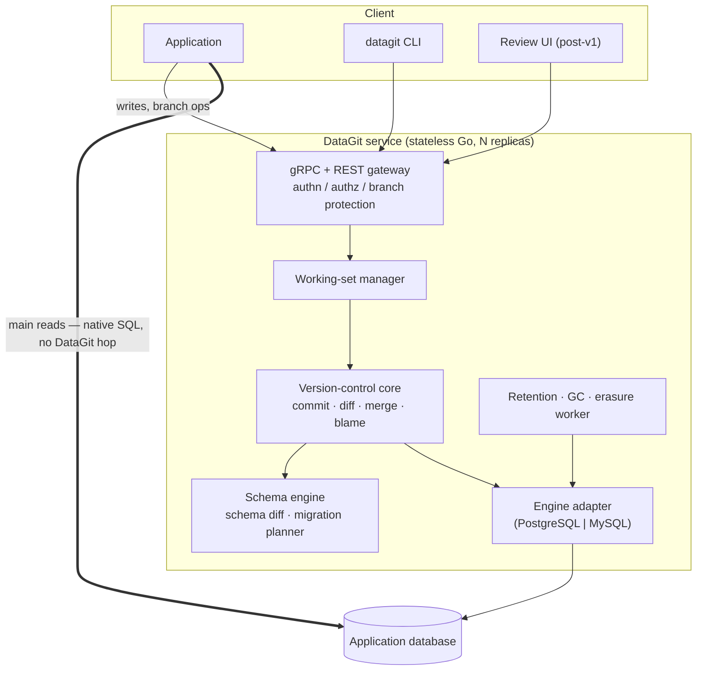

# DataGit — Technical Design

**Status:** draft for review · **Audience:** engineers building or evaluating DataGit
**Companion document:** [README.md](README.md)

---

## Table of contents

1. [Scope, goals, and non-goals](#1-scope-goals-and-non-goals)
2. [Requirements and fixed decisions](#2-requirements-and-fixed-decisions)
3. [Conceptual model](#3-conceptual-model)
4. [Architecture](#4-architecture)
5. [Storage layout](#5-storage-layout)
6. [Write path](#6-write-path)
7. [Read path and branch resolution](#7-read-path-and-branch-resolution)
8. [Diff](#8-diff)
9. [Data merge](#9-data-merge)
10. [Schema versioning and merge](#10-schema-versioning-and-merge)
11. [Consistency and transaction semantics](#11-consistency-and-transaction-semantics)
12. [Integrity and tamper-evidence](#12-integrity-and-tamper-evidence)
13. [Retention, garbage collection, and erasure](#13-retention-garbage-collection-and-erasure)
14. [Performance and scale](#14-performance-and-scale)
15. [Security, authorization, and multi-tenancy](#15-security-authorization-and-multi-tenancy)
16. [API surface](#16-api-surface)
17. [Deployment and operations](#17-deployment-and-operations)
18. [Failure modes](#18-failure-modes)
19. [Alternatives considered and rejected](#19-alternatives-considered-and-rejected)
20. [Open questions and roadmap](#20-open-questions-and-roadmap)

---

## 1. Scope, goals, and non-goals

### 1.1 What we are building

A stateless Go service that sits beside an application's existing PostgreSQL or MySQL database and adds Git-style version control to selected tables in it: commits, branches, tags, diffs, three-way merges, reviewable change proposals, time travel, and per-cell blame.

Two use cases drive every trade-off in this document:

- **Audit, compliance, and rollback.** A complete, attributable, tamper-evident record of every change to regulated or sensitive data, with the ability to read any past state and to undo a specific change without losing the ones after it.
- **Collaborative data curation.** Humans preparing changes to reference and master data on isolated branches, reviewed as a proposal, then merged — with a real three-way merge so two people can work on the same dataset at once.

Where these two pull in different directions, **audit wins on correctness questions and curation wins on ergonomics questions.**

### 1.2 Goals

| # | Goal |
|---|---|
| G1 | Version data **in place**, in the database the application already runs. No new datastore, no data migration, no separate backup story. |
| G2 | **Do not degrade the hot path.** Reads on `main` continue to hit the application's own tables with no proxy, no query rewriting, and no dependency on DataGit's availability. |
| G3 | **Complete and attributable history** for every write to a tracked table, durable in the same transaction as the write itself. |
| G4 | **Branch creation is O(1)** in both time and storage. |
| G5 | **Diff and merge cost scales with the size of the change**, not the size of the table. |
| G6 | **Cell-level three-way merge**, so disjoint edits to the same row combine without human involvement. |
| G7 | **Schema changes are versioned, diffable, and mergeable** — not a hole in the model. |
| G8 | **Right-to-erasure is achievable** without abandoning the integrity guarantees that make the audit trail worth having. |
| G9 | **Two database engines** (PostgreSQL, MySQL) behind one adapter interface, with an honest account of where their behaviour differs. |

### 1.3 Non-goals

| # | Non-goal | Why |
|---|---|---|
| N1 | Being a database or query engine. | The host database plans and executes queries. DataGit rewrites nothing on the `main` read path. |
| N2 | A SQL wire proxy. | Explicitly rejected — see [§19.1](#191-rejected-a-postgresqlmysql-wire-protocol-proxy). |
| N3 | Arbitrary SQL against an arbitrary branch. | Served instead by a structured read API plus branch materialization ([§7.5](#75-branch-materialization)). |
| N4 | Cross-database distributed transactions. | A repository lives in exactly one database instance. |
| N5 | Replacing backups or PITR. | Different failure classes. Version history does not survive the loss of the database. |
| N6 | Versioning every table. | Tracking is opt-in per table, and deliberately so. |
| N7 | Rebase, cherry-pick, submodules, and the long tail of Git. | Deferred; see [§20](#20-open-questions-and-roadmap). |

---

## 2. Requirements and fixed decisions

These were settled before design and are treated as constraints, not options.

| Decision | Choice | Consequence threaded through this document |
|---|---|---|
| **Interface** | gRPC + REST API with SDKs. No wire proxy, no embedded driver. | DataGit performs writes itself; it never has to parse or rewrite arbitrary SQL. |
| **Storage** | History lives inside the application's own database. | No content-addressed object store, no prolly trees. Version state is relational, and every design choice is bounded by what one SQL engine can do efficiently. |
| **Commit model** | Explicit, application-controlled. | A working set (staging area) is required. Commits carry an author, a message, and an optional external reference. |
| **Read path** | `main` reads bypass DataGit entirely. | **The single hardest constraint.** The live table must at all times be a clean, unpolluted, schema-unmodified materialization of `main@HEAD`. This eliminates one whole family of designs ([§19.2](#192-rejected-visibility-columns-on-the-live-table)). |
| **Merge** | Cell-level automatic merge; same-cell divergence surfaced for human resolution. | Requires per-version column-change masks, and rules out storing versions as opaque blobs. |
| **Engines** | PostgreSQL and MySQL. | Constrains the design to the intersection of both, with adapter-local optimizations behind a shared interface. |
| **Schema** | Versioned **and** mergeable. | In tension with the bypass read path; resolved by the gated apply step in [§10.4](#104-merging-schema-into-main-the-apply-step). |
| **Language** | Go. | Single static binary, mature `pgx` and `go-sql-driver/mysql` drivers, straightforward gRPC. |
| **Retention / erasure** | All three mechanisms, combined. | Retention + GC for storage, crypto-shredding as the default erasure path, audited hard purge as the escape hatch. See [§13](#13-retention-garbage-collection-and-erasure). |
| **Scale** | Mixed, per-table opt-in tiers. | `audit` and `versioned` modes with materially different costs. See [§14](#14-performance-and-scale). |
| **Deployment** | Stateless Go binary, horizontally scalable, all state in the target database. | No leader election, no local disk, no cache coherence problem. |
| **Auth** | Single-tenant per deployment. Pluggable OIDC/JWT + API keys. Branch protection rules. | Every commit carries a verified author identity. |
| **Consistency** | `main` writes commit in the same DB transaction as the live-table update. | Direct readers never observe a state that is not some `main` commit. |
| **Non-versioned FKs** | Allowed, with documented caveats. | Referential integrity across the versioned boundary is the application's responsibility. |
| **Licence** | Apache 2.0. | — |

---

## 3. Conceptual model

### 3.1 Objects

```
Repository
├── Table            (physical table + mode + primary key + schema history)
├── Commit           (immutable; hash-chained; parents; author; message; change set)
├── Branch           (mutable ref → commit; fork point; protection rules)
├── Tag              (immutable ref → commit)
├── WorkingSet       (per branch: uncommitted changes = the staging area)
└── Proposal         (branch → branch merge request: diff, comments, approvals, state)
```

### 3.2 Row identity

**A row's identity is its primary key**, per table, for all of history.

This is the load-bearing simplification of the entire design. It is what makes diff a keyed set comparison and merge a keyed three-way fold. It has one consequence that must be stated loudly because it will surprise people:

> **Changing a primary key is a delete plus an insert.** History does not follow a row across a primary-key change, and blame on the new key begins at the insert.

Tables with no primary key, or with a mutable primary key, cannot be tracked in `versioned` mode. `audit` mode accepts them with an internal surrogate identity and loses cross-version linkage. This is a real limitation, not a temporary one; see [§20](#20-open-questions-and-roadmap).

### 3.3 The commit sequence

Every branch carries a monotonically increasing local **commit sequence** (`seq`), assigned on commit. A commit is globally identified by its content hash; `seq` exists purely so that "the state of branch B at commit c" becomes an interval predicate a B-tree can answer.

The commit graph is a DAG. `seq` is *not* a global ordering across branches and must never be compared across them.

### 3.4 Tracking modes

| | `audit` | `versioned` |
|---|---|---|
| Full version history | ✅ | ✅ |
| Time travel, blame | ✅ | ✅ |
| Revert a commit | ✅ | ✅ |
| Branch, diff, merge | ❌ | ✅ |
| Requires stable PK | preferred | **required** |
| Storage at rest | 1× + history | ~2× + history |
| Added p99 write latency (target) | < 2 ms | < 5 ms |

`audit` is the tier for high-volume tables where you want the record but will never branch. `versioned` is the tier for data humans curate.

---

## 4. Architecture

### 4.1 Component view



The double line is the point of the architecture. Application read traffic on `main` never enters the service. DataGit can be down, restarting, or being deployed, and production reads are unaffected. Writes and version-control operations stop; reads do not.

### 4.2 Why the service is stateless

All durable state — commits, refs, working sets, versions, proposals — lives in the application's database. Replicas hold no authoritative state, so:

- Scale horizontally behind any load balancer; no session affinity.
- No leader election, no consensus, no local disk.
- Correctness under concurrency is the database's job, using row locks and advisory locks ([§11.3](#113-concurrency-control)).
- The failure story is the database's failure story, which the operator already understands.

### 4.3 The engine adapter

A single Go interface isolates every engine-specific decision:

```go
type Adapter interface {
    // Identity and capability
    Dialect() Dialect
    Capabilities() Caps          // transactional DDL, MERGE, RETURNING, advisory locks, ...

    // DDL for sidecars and materialization
    CreateSidecar(ctx context.Context, tx Tx, t *TableSpec) error
    EvolveSidecar(ctx context.Context, tx Tx, from, to *SchemaVersion) error
    MaterializeBranch(ctx context.Context, tx Tx, b *Branch, into string) error

    // Query construction — the resolution query differs materially per engine
    ResolveQuery(spec *ResolveSpec) (sql string, args []any, err error)
    DiffQuery(spec *DiffSpec) (sql string, args []any, err error)

    // Locking and isolation
    AcquireRefLock(ctx context.Context, tx Tx, ref RefID) error
    ApplyMigration(ctx context.Context, plan *MigrationPlan) error
}
```

The differences that actually matter:

| Concern | PostgreSQL | MySQL 8 | Resolution |
|---|---|---|---|
| Branch resolution query | `DISTINCT ON (pk) ... ORDER BY priority` | no `DISTINCT ON`; needs `ROW_NUMBER() OVER (...)` | Both produced by `ResolveQuery`; the MySQL form is portable, so it is the reference implementation and Postgres gets the faster variant. |
| Transactional DDL | Yes | **No** — implicit commit per DDL | Schema apply is a resumable, journalled, idempotent state machine, not a transaction ([§10.4](#104-merging-schema-into-main-the-apply-step)). This is the single largest source of engine divergence. |
| Advisory locks | `pg_advisory_xact_lock` | `GET_LOCK` (session-scoped, not txn-scoped) | Adapter method; MySQL requires explicit release with defer + reaper. |
| Structured values | `jsonb` | `json` | Only used for metadata columns, never for row payloads. |
| Sequences | `bigserial` / identity | `AUTO_INCREMENT` | Adapter-generated DDL. |
| Change masks | `bit varying` or `text[]` | `varbinary` | Normalized to a `[]byte` bitmask in Go; `text[]` is a Postgres-only readability optimization. |

**Non-goal for the adapter:** hiding real semantic differences. Where an engine cannot do something (MySQL and transactional DDL), the design changes to accommodate the weaker engine rather than pretending.

---

## 5. Storage layout

### 5.1 The three layers

For every tracked table `T`:

| Layer | Object | Contents |
|---|---|---|
| **Live** | `T` | The application's own table, schema **unmodified**. Invariant: `T` ≡ `main@HEAD`. |
| **Versions** | `datagit_v_T` | One row per row-version, typed columns mirroring `T`, valid over a half-open `seq` interval on one branch. |
| **Control** | `datagit_*` | Repositories, tables, commits, refs, working sets, proposals, keys, journals. Shared, not per-table. |

The live table gets **no added columns, no triggers on the happy path, and no view substitution**. That is what buys goal G2.

### 5.2 Version sidecars

One typed sidecar per tracked table, generated from that table's schema and evolved with it.

```sql
-- Generated for a tracked table `products` with primary key (sku).
CREATE TABLE datagit_v_products (
    version_id    bigserial    PRIMARY KEY,
    branch_id     uuid         NOT NULL,
    seq_from      bigint       NOT NULL,
    seq_to        bigint       NOT NULL DEFAULT 9223372036854775807,  -- open interval
    op            smallint     NOT NULL,          -- 1=insert 2=update 3=delete
    commit_id     bytea        NOT NULL,          -- 32-byte hash; NULL-equivalent 0x00.. while staged
    changed_cols  bytea        NOT NULL,          -- bitmask over the schema's column ordinals

    -- mirrored primary key columns, real types, NOT NULL
    sku           text         NOT NULL,

    -- mirrored value columns, real types, always nullable
    name          text,
    category      text,
    price         numeric(12,2),
    updated_at    timestamptz
);

CREATE INDEX v_products_resolve  ON datagit_v_products (branch_id, sku, seq_from DESC);
CREATE INDEX v_products_range    ON datagit_v_products (branch_id, seq_from, seq_to);
CREATE INDEX v_products_commit   ON datagit_v_products (commit_id);
```

Four decisions embedded here, each with a cost:

**(a) Typed mirrored columns, not a JSON blob.**
JSON payloads would be simpler and immune to schema drift. Typed columns are chosen because branch reads must support real predicates on real indexes, merges must validate real constraints, and diffs must compare typed values with the engine's own equality semantics. The cost is that every schema change must evolve the sidecar too — which the schema engine already has to do, so the marginal cost is low.

**(b) Full row image per version, not a column-level delta.**
Reconstructing a row from a delta chain is O(depth), and the depth of a hot row is unbounded. Storing the full image makes every point read O(1). The `changed_cols` bitmask supplies exactly the delta information the merge algorithm needs, at 1 bit per column, without paying delta-chain reconstruction on reads. Space is traded for read simplicity, deliberately.

**(c) Open versions are stored for `main` too, duplicating the live table.**
The alternative — treating the live table as the implicit open version and storing only superseded ones — halves storage but makes "what was `main` at commit `c`" a query that must reason about rows *absent* from the sidecar, and cannot tell a row inserted after `c` from one that has been current since before it without a second shadow index. Duplication is chosen: it makes every historical read a pure sidecar query, with the live table used only by direct readers. This is the ~2× storage cost in [§3.4](#34-tracking-modes), and it is the largest single storage decision in the design. `audit` mode avoids it by storing closed intervals only, since it never needs branch resolution.

**(d) `seq_to` is an explicit sentinel, not `NULL`.**
`NULL` in a range predicate defeats index usage on both engines and forces `COALESCE`. A max-`bigint` sentinel keeps `seq_from <= ? AND seq_to > ?` a clean index range scan.

### 5.3 Control tables

```sql
CREATE TABLE datagit_repo (
    id            uuid PRIMARY KEY,
    name          text NOT NULL UNIQUE,
    default_branch uuid NOT NULL,
    created_at    timestamptz NOT NULL DEFAULT now()
);

CREATE TABLE datagit_table (
    id            uuid PRIMARY KEY,
    repo_id       uuid NOT NULL REFERENCES datagit_repo(id),
    physical_name text NOT NULL,
    mode          text NOT NULL CHECK (mode IN ('audit','versioned')),
    pk_columns    text[] NOT NULL,
    tracked_at    timestamptz NOT NULL,
    state         text NOT NULL,        -- active | backfilling | paused | untracking
    UNIQUE (repo_id, physical_name)
);

CREATE TABLE datagit_commit (
    id            bytea PRIMARY KEY,    -- 32-byte content hash, see §12.1
    repo_id       uuid   NOT NULL REFERENCES datagit_repo(id),
    branch_id     uuid   NOT NULL,
    seq           bigint NOT NULL,
    parent_ids    bytea[] NOT NULL,     -- 1 normally, 2 for a merge, 0 for the root
    author        text   NOT NULL,      -- verified identity, §15.2
    author_at     timestamptz NOT NULL,
    committer     text   NOT NULL,
    committed_at  timestamptz NOT NULL,
    message       text   NOT NULL,
    external_ref  text,                 -- ticket / change-request id
    change_digest bytea  NOT NULL,      -- Merkle root over the change set, §12.1
    schema_epoch  bigint NOT NULL,      -- pointer into schema history
    integrity     text   NOT NULL DEFAULT 'intact',  -- intact | purged, §13.4
    UNIQUE (repo_id, branch_id, seq)
);

CREATE TABLE datagit_ref (
    id            uuid PRIMARY KEY,
    repo_id       uuid NOT NULL REFERENCES datagit_repo(id),
    kind          text NOT NULL CHECK (kind IN ('branch','tag')),
    name          text NOT NULL,
    head_commit   bytea,                        -- NULL only for an empty new branch
    parent_ref    uuid REFERENCES datagit_ref(id),
    fork_commit   bytea,                        -- the commit on parent_ref this diverged from
    protected     boolean NOT NULL DEFAULT false,
    min_approvals smallint NOT NULL DEFAULT 0,
    created_by    text NOT NULL,
    created_at    timestamptz NOT NULL DEFAULT now(),
    UNIQUE (repo_id, kind, name)
);

CREATE TABLE datagit_working_set (
    branch_id     uuid PRIMARY KEY REFERENCES datagit_ref(id),
    base_commit   bytea NOT NULL,
    dirty_tables  uuid[] NOT NULL DEFAULT '{}',
    updated_at    timestamptz NOT NULL
);

CREATE TABLE datagit_proposal (
    id            bigserial PRIMARY KEY,
    repo_id       uuid NOT NULL,
    from_ref      uuid NOT NULL REFERENCES datagit_ref(id),
    into_ref      uuid NOT NULL REFERENCES datagit_ref(id),
    title         text NOT NULL,
    description   text,
    state         text NOT NULL,   -- open | conflicted | approved | merged | closed
    merge_commit  bytea,
    created_by    text NOT NULL,
    created_at    timestamptz NOT NULL DEFAULT now()
);

-- plus: datagit_schema_version, datagit_conflict, datagit_review,
--       datagit_migration_journal, datagit_dek, datagit_purge_log, datagit_checkpoint
```

Uncommitted working-set changes live in the same sidecar with `commit_id` set to the zero hash and `seq_from` set to the branch's next sequence number. Committing is therefore a metadata operation — stamp the rows with the real commit hash — not a data copy. That keeps commit cost proportional to the change, not the table.

---

## 6. Write path

### 6.1 Writing to `main`

The critical path. Everything about it is shaped by the invariant `T ≡ main@HEAD`.

```mermaid
sequenceDiagram
    participant App
    participant DG as DataGit
    participant DB as Database

    App->>DG: Update(main, products, {sku: TENT-4P}, {price: 268.92})
    DG->>DB: BEGIN
    DG->>DB: SELECT ... FROM products WHERE sku = $1 FOR UPDATE
    Note over DG: read the current image; compute changed_cols
    DG->>DB: UPDATE products SET price = $1 WHERE sku = $2
    DG->>DB: UPDATE datagit_v_products SET seq_to = $seq WHERE branch=main AND sku=$1 AND seq_to = MAX
    DG->>DB: INSERT INTO datagit_v_products (...) VALUES (...)  -- new open version
    DG->>DB: COMMIT
    DG-->>App: ok
```

Three properties fall out of doing this in one transaction:

1. **No skew for direct readers.** A concurrent reader on the live table sees either the pre-state or the post-state, and both are valid `main` commits.
2. **No lost history.** History cannot be recorded for a write that rolled back, and a write cannot succeed with its history missing. There is no reconciliation job because there is nothing to reconcile.
3. **`SELECT ... FOR UPDATE` serializes writers per row.** Concurrent writers to the same row queue; writers to different rows do not contend.

Under an explicit commit model these writes are *staged*: they land in the sidecar with the zero commit hash. `Commit` then stamps them, appends `datagit_commit`, and advances the ref — also in one transaction. Between staging and commit, the live table has already moved. This is intentional and must be documented for users: **on `main`, staged writes are visible to direct readers immediately.** `main` is the place where the world is, not a scratch pad. Work that should be invisible until reviewed belongs on a branch.

### 6.2 Writing to a non-`main` branch

Strictly simpler, and it never touches the live table:

1. Resolve the row's current state on the branch ([§7](#7-read-path-and-branch-resolution)).
2. Close the branch's own open version for that key, if it has one.
3. Insert a new open version with `branch_id` = this branch.

Cost is one or two sidecar writes. The live table is untouched, so branch activity cannot affect production read performance, and a runaway branch job cannot degrade `main`.

### 6.3 Out-of-band writes

The `T ≡ main@HEAD` invariant holds only while writes go through DataGit. Something will eventually write directly — a psql session, a legacy job, a migration tool. Three options, per table:

| Mode | Mechanism | Cost |
|---|---|---|
| `open` (default) | Nothing. Drift is possible and undetected until a verification scan. | Zero |
| `guarded` | `BEFORE INSERT/UPDATE/DELETE` trigger rejects writes lacking DataGit's session marker. | ~1 trigger invocation per write; **hard-fails legacy writers** |
| `capture` | Trigger writes the change into the sidecar as an `external` commit, author `system:out-of-band`. | Full trigger CDC cost — measurable write amplification |

`capture` uses the classic trigger-based CDC approach, which fires synchronously on every write and adds latency and write amplification to the source table. That is precisely the cost DataGit's API-first write path avoids on the happy path, so `capture` is offered as a compatibility bridge for tables with legacy writers, not as a recommended steady state.

A background **verification scan** (`datagit verify`) samples or fully scans the live table against `main@HEAD` and reports divergence, regardless of mode. It is cheap to run on a replica.

### 6.4 Enabling tracking on a non-empty table

`datagit track` runs an online backfill:

1. Record the table, mark `state = 'backfilling'`.
2. Create the sidecar.
3. Chunked copy of the live table into the sidecar as the root commit, by primary-key ranges, with a bounded rate limit.
4. Concurrent DataGit writes during backfill are staged normally and reconciled by sequence.
5. Mark `state = 'active'`, write the root commit.

History before this point does not exist and is never fabricated. The root commit is honestly labelled `import`.

---

## 7. Read path and branch resolution

### 7.1 `main` at HEAD

`SELECT * FROM products` — issued by the application, straight to the database. DataGit is not involved and adds nothing. This is the overwhelming majority of read traffic and the reason the whole design is shaped the way it is.

### 7.2 `main` at a past commit

A pure interval query over the sidecar:

```sql
SELECT sku, name, category, price, updated_at
FROM   datagit_v_products
WHERE  branch_id = :main
  AND  seq_from <= :c AND seq_to > :c
  AND  op <> 3                       -- exclude deletes
```

Index `(branch_id, seq_from, seq_to)` serves it. Cost is proportional to the live row count at commit `c`, and any application predicate pushes down onto the mirrored typed columns.

### 7.3 An arbitrary branch at an arbitrary commit

A branch stores only its own divergence. Everything it did not change must fall through to its parent, at the fork point — recursively.

**Resolution.** Walk the branch's ancestry to build a *segment chain*: an ordered list of `(branch_id, seq)` pairs from the target branch down to the root branch, where each entry's `seq` is the fork point at which the next branch diverged.

```
resolve(B, c):
  segments := [(B, c)]
  cur := B
  while cur.parent_ref is not null:
      segments.append((cur.parent_ref, seq_of(cur.fork_commit)))
      cur := cur.parent_ref
  # segments[0] is highest priority
```

Then, for each primary key, take the version from the highest-priority segment that has one:

```sql
-- PostgreSQL form
SELECT DISTINCT ON (sku) sku, name, category, price, updated_at, op
FROM (
    SELECT 0 AS prio, v.* FROM datagit_v_products v
      WHERE v.branch_id = :b0 AND v.seq_from <= :c0 AND v.seq_to > :c0
    UNION ALL
    SELECT 1 AS prio, v.* FROM datagit_v_products v
      WHERE v.branch_id = :b1 AND v.seq_from <= :c1 AND v.seq_to > :c1
    -- ... one arm per segment
) s
ORDER BY sku, prio
-- then filter op <> 3 in the outer scope, so a branch-level delete
-- correctly masks an inherited row rather than falling through to it.
```

MySQL uses `ROW_NUMBER() OVER (PARTITION BY sku ORDER BY prio)` with an outer `WHERE rn = 1`; the shape is identical.

**Cost.** One index range scan per segment, plus a merge. Segment count equals branch nesting depth, which in practice is 1 or 2 (`feature → main`) and is hard-capped at 8. Deep chains are the pathological case; the cap makes the worst case bounded and stated rather than discovered in production.

**Deletes must not fall through.** A `op = 3` tombstone on a high-priority segment wins resolution and is then filtered out, so the row is absent. Filtering `op <> 3` *inside* the union arms instead would be a correctness bug — the inherited row would resurface. This is the most likely place for a subtle mistake in an implementation and is called out for that reason.

### 7.4 The structured read API

DataGit does not accept arbitrary SQL for branch reads. It exposes:

- `Get(table, pk, at)` — point read.
- `Scan(table, filter, order, cursor, limit, at)` — filter is a typed predicate tree over real columns (comparison, `IN`, `LIKE`, `IS NULL`, `AND`/`OR`/`NOT`), compiled to parameterized SQL. No string interpolation of user input, ever.
- `Blame(table, pk, columns)` — per-cell attribution.
- `History(table, pk)` — the version chain for one row.

This is a bounded surface that DataGit can compile safely and index well. It deliberately does not attempt joins, aggregates, or subqueries against a branch.

### 7.5 Branch materialization

For anything the structured API cannot express — an analyst with a BI tool, a test suite that needs the real ORM, a report with six joins — materialize the branch:

```bash
datagit materialize q4-pricing --into schema q4_pricing_20260901
```

This runs the resolution query per table into real tables in a new schema, with the branch's schema version and its indexes. The result is an ordinary set of tables any client can query with unrestricted SQL. It is a **copy**, so it costs time and storage proportional to the data, it is a point-in-time snapshot, and it is not writable back into the branch. Materializations are tracked, TTL'd, and garbage-collected.

This is the deliberate escape hatch that lets [§1.3 N3](#13-non-goals) stand. Rather than building a query engine, DataGit hands the problem to the one already present.

---

## 8. Diff

### 8.1 Two-point diff on one branch

The changes between two commits on the same branch are exactly the sidecar rows whose interval boundaries fall between them:

```sql
SELECT * FROM datagit_v_products
WHERE branch_id = :b
  AND (   (seq_from >  :c1 AND seq_from <= :c2)     -- versions created in the range
       OR (seq_to   >  :c1 AND seq_to   <= :c2) )   -- versions closed in the range
```

Cost is proportional to the number of changes in the range — goal G5 — because the index is on `(branch_id, seq_from, seq_to)` and untouched rows are never visited. This is the relational analogue of what a content-addressed tree gets from comparing subtree hashes; the mechanism is different, the asymptotics are the same.

### 8.2 Cross-branch diff

`diff(A, B)` is defined against their merge base, so it answers "what would merging do", not "how do these two sets differ":

1. `base := merge_base(A, B)` — lowest common ancestor over the commit DAG ([§9.1](#91-finding-the-merge-base)).
2. `ΔA := diff(base, A)`, `ΔB := diff(base, B)`, each by [§8.1](#81-two-point-diff-on-one-branch) along its own branch chain.
3. Present per table: added / removed / modified counts, then per row, then per cell using `changed_cols`.

### 8.3 Output granularity

```
~ products                              312 modified, 4 added, 1 removed
  ~ products[sku=TENT-4P]
      price       249.00  →  268.92
      updated_at  2026-03-02  →  2026-08-14
  + products[sku=TARP-XL]
  - products[sku=STOVE-V1]
```

Machine-readable equivalents are available as JSON and as a row stream over gRPC for large diffs. Diffs are paginated by primary key so a million-row diff streams rather than materializing.

---

## 9. Data merge

Three-way merge against the common ancestor, resolved per cell.

### 9.1 Finding the merge base

Lowest common ancestor over the commit DAG by bidirectional breadth-first search from both heads.

**Multiple merge bases.** Criss-cross merge histories can produce more than one LCA. Git resolves this by recursively merging the bases. DataGit v1 does **not**: when multiple bases are found, the merge is refused with an explicit error naming the candidates, and the user is asked to merge in a different order. Recursive base merging is deferred rather than approximated, because silently picking one base produces a result that is wrong in a way nobody will notice until it matters. See [§20](#20-open-questions-and-roadmap).

### 9.2 The algorithm

For each tracked table, for each primary key appearing in `ΔA ∪ ΔB`, compare the base version `b`, ours `a`, and theirs `t`:

| Case | `b` | `a` | `t` | Result |
|---|---|---|---|---|
| Untouched by one side | any | = b | ≠ b | take `t` |
| Untouched by other side | any | ≠ b | = b | take `a` |
| Identical change | any | x | x | take `x`, clean |
| **Disjoint cells** | present | modifies cols C₁ | modifies cols C₂, C₁ ∩ C₂ = ∅ | **merge per cell**, clean |
| **Same cell, same value** | present | col c → v | col c → v | take v, clean |
| **Same cell, different value** | present | col c → v₁ | col c → v₂ | **conflict** |
| Add / add, identical | absent | insert x | insert x | take x, clean |
| Add / add, different | absent | insert x | insert y | **conflict** |
| Delete / delete | present | delete | delete | delete, clean |
| **Delete / modify** | present | delete | modify | **conflict** — never guessed |
| Delete / unchanged | present | delete | = b | delete |

Cell-level merging is what `changed_cols` exists for: the mask says exactly which columns each side touched, so disjointness is a bitmask AND rather than a value-by-value comparison against the base. Two curators editing `price` and `description` on the same product never collide.

**Delete/modify is always a conflict.** Neither answer is safe to assume — one side believes the row should not exist, the other believes it should exist with new content. Any automatic resolution silently discards someone's intent.

### 9.3 Constraint validation

A cell-clean merge can still produce an invalid table: one branch deletes a parent row while the other inserts a child referencing it; two branches insert different rows with the same unique key.

Dolt's approach is to let the merge land and record violations in a system table for later resolution. DataGit cannot do that, because merging into `main` writes the live table, which carries the application's real constraints — the database would simply reject it, mid-merge, with a partial result.

So merges are **validated before apply**:

1. Compute the merged result set into a temporary staging relation.
2. Validate: primary-key uniqueness, every unique index, check constraints, and foreign keys *within* the repository.
3. Any violation converts the merge into a `conflicted` proposal listing the violations as first-class conflicts alongside the cell conflicts.
4. Only a fully clean, fully validated merge is applied.

**Foreign keys to non-versioned tables are not validated by DataGit** — it has no history for the referenced side and cannot know whether the target existed at any given commit. The database's own constraint will reject the merge at apply time if it is violated. This is documented as a caveat, per the fixed decisions in [§2](#2-requirements-and-fixed-decisions), and it is a genuine sharp edge: a merge that passed DataGit's validation can still fail at apply. When it does, the transaction rolls back atomically and the proposal is marked `conflicted` with the database's own error attached.

### 9.4 Conflict resolution

Conflicts are persisted, not held in memory:

```sql
CREATE TABLE datagit_conflict (
    id           bigserial PRIMARY KEY,
    proposal_id  bigint NOT NULL REFERENCES datagit_proposal(id),
    table_id     uuid   NOT NULL,
    pk_json      jsonb  NOT NULL,
    column_name  text,                 -- NULL for whole-row conflicts
    kind         text   NOT NULL,      -- cell | add_add | delete_modify | unique | fk | check
    base_value   jsonb,
    our_value    jsonb,
    their_value  jsonb,
    resolution   text,                 -- ours | theirs | custom | NULL while unresolved
    resolved_value jsonb,
    resolved_by  text,
    resolved_at  timestamptz
);
```

Resolution is an API call per conflict (or in bulk with `--ours` / `--theirs`), then the merge is re-validated and applied. Because conflicts are rows in the database, a half-resolved merge survives a service restart, a redeploy, and a reviewer going home for the weekend.

### 9.5 Applying a merge into `main`

One transaction:

1. `AcquireRefLock(main)` — serializes against other merges and commits.
2. Re-verify `main@HEAD` has not moved since validation; if it has, re-run [§9.2](#92-the-algorithm) and [§9.3](#93-constraint-validation).
3. Apply the merged change set to the live table (`INSERT`/`UPDATE`/`DELETE`).
4. Close superseded `main` versions; insert new open versions.
5. Write the merge commit with **two parents**.
6. Advance the `main` ref.
7. `COMMIT`.

At the moment of commit, every direct reader of the live table moves from one valid `main` commit to the next, atomically. There is no window in which the live table shows a half-merged state.

---

## 10. Schema versioning and merge

### 10.1 Schema as a versioned object

Each table's schema at each commit is a `datagit_schema_version` row: ordered columns with types, nullability, and defaults; indexes; constraints; and the primary key. It carries a digest so schema equality is a hash comparison.

A commit references a `schema_epoch`. Historical reads project the stored row through the schema of the commit being read — a column added after commit `c` reads as absent at `c`, not as `NULL`, and a dropped column's values remain readable in history.

### 10.2 Schema diff

Computed structurally, producing a typed list of operations: `AddColumn`, `DropColumn`, `AlterColumnType`, `SetNotNull`, `DropNotNull`, `SetDefault`, `RenameColumn`, `AddIndex`, `DropIndex`, `AddConstraint`, `DropConstraint`, `AddTable`, `DropTable`.

Renames are detected only when declared explicitly. An inferred rename that guesses wrong is a silent data-destroying error, so it is not inferred.

### 10.3 Schema merge

Schema merges before data, because the data merge needs to know the shape it is producing.

| Both branches | Result |
|---|---|
| Add the same column, identical definition | clean |
| Add the same column, different definitions | **conflict** |
| Add different columns | clean |
| One alters, one leaves alone | take the alteration |
| Both alter the same column identically | clean |
| Both alter the same column differently | **conflict** |
| One drops a column, the other writes to it | **conflict** |
| One drops, one leaves alone | drop — with a warning, because it is destructive and irreversible for future writes |
| Add the same index, different definition | **conflict** |

### 10.4 Merging schema into `main`: the apply step

**This is where DataGit is deliberately not Git-like, and it is a direct consequence of the fixed decision that `main` reads bypass the service.**

The tension: applications read the live tables directly, with compiled queries and ORM models that assume a shape. If merging a branch instantly dropped a column from the live table, every direct reader would start failing — with no warning, no rollout, and no way to sequence a code deploy around it.

So a data merge into `main` applies immediately, but a **schema** merge into `main` produces a **migration plan** that must be applied deliberately:

```bash
datagit proposal merge 17
# → data changes merged (312 rows)
# → 1 schema change requires apply:
#     ALTER TABLE products ADD COLUMN margin_pct numeric(5,2)  [additive, online]
#   run: datagit migration apply 17
```

Operations are classified:

| Class | Examples | Behaviour |
|---|---|---|
| **Additive** | add nullable column, add index concurrently | Applied online. Safe for existing readers, which simply ignore the new column. |
| **Widening** | `varchar(50) → varchar(200)`, `int → bigint`, drop `NOT NULL` | Applied online. Existing readers keep working. |
| **Narrowing** | add `NOT NULL`, add a unique constraint, narrow a type | Requires a pre-flight scan proving no existing row violates it, plus explicit confirmation. |
| **Destructive** | drop column, drop table, incompatible type change | Requires explicit confirmation **and** a stated reader-compatibility window. Defaults to a two-phase apply: mark the column deprecated and unwritable now, physically drop it after the window. |

**MySQL has no transactional DDL.** A multi-statement migration that fails halfway cannot be rolled back by the engine. So `ApplyMigration` is a resumable state machine, not a transaction: each operation is journalled to `datagit_migration_journal` before execution and marked complete after, every operation is written to be idempotent, and a crashed apply resumes from the journal rather than restarting or being left indeterminate. PostgreSQL could use a single transaction, but runs the same state machine so that behaviour under failure is identical on both engines and only has to be tested once.

While a migration is applying, writes to the affected table are held (not failed) behind the ref lock, up to a configurable timeout.

---

## 11. Consistency and transaction semantics

### 11.1 Guarantees

| Guarantee | Scope |
|---|---|
| A write to `main` and its version record commit atomically. | Always. |
| A direct reader of the live table sees only states that are valid `main` commits. | Always, at the database's own isolation level. |
| A commit is atomic — all of its changes become visible together, or none do. | Always. |
| A merge into `main` is atomic. | Always. |
| Non-`main` branch state is visible only through DataGit. | By construction. |
| Reads through DataGit are at the isolation level of the underlying database. | Default `READ COMMITTED`; `REPEATABLE READ` available per request. |

### 11.2 What is explicitly *not* guaranteed

- **No cross-repository atomicity.** A repository is one database.
- **No atomicity between a DataGit write and an application write issued outside DataGit** in a different transaction.
- **Replica reads are as stale as the replica.** DataGit will route historical and branch reads to a read replica when configured, and says so.
- **Staged writes on `main` are visible immediately to direct readers** ([§6.1](#61-writing-to-main)).

### 11.3 Concurrency control

| Contention | Mechanism |
|---|---|
| Two writers, same row, same branch | `SELECT ... FOR UPDATE` on the live row (`main`) or the open sidecar version (branch). |
| Two commits, same branch | Advisory lock on the ref, held for the commit transaction. Serializes `seq` assignment. |
| Two merges into the same branch | Same ref lock. The second re-validates against the moved head. |
| Merge vs. concurrent write to `main` | Ref lock; the writer waits. Merge apply is short because the change set is already computed. |
| Migration apply vs. writes | Ref lock plus a table-level guard; writers wait up to a timeout, then fail with a retryable error. |

MySQL's `GET_LOCK` is session-scoped rather than transaction-scoped, so the adapter releases explicitly on transaction end and a reaper clears locks held by dead sessions.

---

## 12. Integrity and tamper-evidence

### 12.1 The commit hash chain

```
change_digest = MerkleRoot( sorted, per table:
                    H(table_id ‖ pk_canonical ‖ op ‖ changed_cols ‖ value_canonical) )

commit_id     = SHA-256( "datagit.commit.v1"
                       ‖ repo_id ‖ sorted(parent_ids)
                       ‖ change_digest ‖ schema_digest
                       ‖ author ‖ author_at ‖ message ‖ external_ref )
```

Canonical value encoding is fixed and versioned so that hashes are reproducible across engines and across releases. Any change to a committed row, to a commit's metadata, or to the parent structure changes the hash and is detectable by `datagit verify --integrity`, which recomputes the chain.

### 12.2 The honest limit

**DataGit's history lives in the same database as the data, so anyone with direct write access to that database can rewrite both the rows and the hashes that attest to them.** This is tamper-*evidence* against application-level and accidental corruption. It is **not** tamper-proofing against a privileged operator, and the design does not claim otherwise. Anyone evaluating DataGit for a regulatory requirement that demands operator-proof immutability should read this paragraph as a disqualifier for that requirement, absent the mitigations below.

### 12.3 Mitigations

- **External anchoring.** A periodic signed checkpoint — `(repo, branch, head commit id, seq, timestamp)` — written to an append-only external store (S3 Object Lock, a WORM bucket, a managed ledger, or a signed log). Rewriting history then requires compromising two systems with different access control, and the checkpoint proves what the head was at a point in time.
- **Commit signing.** Optional Ed25519 signatures over `commit_id` using a per-author key, so a forged commit cannot carry a valid signature.
- **Least privilege.** DataGit's database role owns the `datagit_*` tables; the application role gets no write access to them. This does not stop a superuser, and is not claimed to.

---

## 13. Retention, garbage collection, and erasure

Three distinct problems, routinely conflated. Retention bounds storage. GC reclaims unreachable versions. Erasure satisfies a legal obligation. Each needs its own mechanism.

### 13.1 Retention policies

Per table or per repository:

- **Age:** keep history for N days.
- **Depth:** keep the last N commits.
- **Density:** keep all versions for N days, then thin to one version per row per day/week beyond that.
- **Protected:** commits that are tagged, are a branch head, are an ancestor of a branch head, or are referenced by a proposal are never pruned.

Pruning rewrites interval boundaries: the versions being removed are collapsed into the oldest surviving version, whose `seq_from` moves back. The record that *something* happened is retained as a thinned marker even when the intermediate values are not, so history never silently claims a row was unchanged over a period when it was.

### 13.2 Garbage collection

Deleting a branch makes its versions unreachable. GC removes them in bounded batches after a grace period (default 7 days, so an accidental branch deletion is recoverable). It runs as a background worker on a leader-elected schedule — via a database advisory lock, since the service is otherwise stateless — and is rate-limited to avoid competing with foreground traffic.

### 13.3 Crypto-shredding — the default erasure path

The mechanism that resolves the GDPR-Article-17-versus-immutable-history tension without breaking the audit trail.

- Columns are declared as PII and associated with a **data subject** (typically a customer id resolvable from the row).
- Each subject gets a **data encryption key (DEK)**, envelope-encrypted under a KMS key and stored in `datagit_dek`.
- PII column values are encrypted with the subject's DEK at write time, in both the live table and the sidecar.
- **Erasure = destroying the DEK.** The key material is nulled, a keyref tombstone survives, and every ciphertext for that subject — across every commit, every branch, every backup, and every replica — becomes indistinguishable from random bytes, simultaneously and without touching a single history row.

Because no history row is modified, **the hash chain stays valid** and the audit trail remains verifiable. The erasure itself is recorded as an immutable erasure-fact commit: who requested it, who executed it, when, and for which subject.

The costs are real and must be stated:

- Encrypted columns are **not queryable** by predicate, and cannot be indexed for range or prefix search. Equality search requires deterministic encryption, which leaks equality — offered as an explicit per-column opt-in with the leak documented, not as a default.
- Key management becomes a hard operational dependency. Losing a DEK is indistinguishable from erasing it.
- It only protects columns designated as PII. Personal data that leaks into a `notes` field is not covered.

### 13.4 Hard purge — the audited escape hatch

For what crypto-shredding cannot reach: PII in a non-designated column, a court order, a regulator demanding physical removal.

`purge` is a privileged operation that physically deletes a row's versions across all commits and branches. It:

1. Requires an elevated `purge` capability and a stated reason.
2. Deletes the matching versions from every sidecar and the live table.
3. Leaves a **tombstone** recording that a purge occurred, by whom, when, why, and how many versions — never the purged content.
4. Marks every affected commit `integrity = 'purged'`.
5. Appends an immutable purge record to `datagit_purge_log`.

Point 4 is the important one. A purged commit's hash **no longer matches its content**, and `datagit verify` will report that. Rather than recomputing hashes to hide the gap, DataGit records the discontinuity explicitly, so the difference between "an authorized erasure happened here" and "someone tampered with this" is preserved and visible. Silently re-hashing would make the audit trail lie, which is worse than a documented gap.

---

## 14. Performance and scale

### 14.1 Recommended target: mixed, per-table opt-in

Uniform targets would be dishonest: the two use cases have different shapes. The recommendation is the two-tier model from [§3.4](#34-tracking-modes), with these **design targets** (targets to build and benchmark against — not measured results):

| | `audit` tier | `versioned` tier |
|---|---|---|
| Rows per table | up to ~500 M (partitioned sidecar) | up to ~50 M |
| Write throughput | ~10 k writes/s per repository | ~1 k writes/s per repository |
| Commits | continuous, machine-driven | 10²–10³ per day, human-driven |
| Concurrent branches | n/a | 10²; hard cap 10³ per repository |
| Added write latency (p99) | < 2 ms | < 5 ms |
| Branch creation | — | < 50 ms, O(1), no data copied |
| Diff of 10 k changed rows | — | < 1 s |
| Merge of 10 k changed rows | — | < 10 s including validation and apply |
| `main` read latency | **unchanged — DataGit is not on the path** | **unchanged** |

Rationale: `versioned` mode's costs are dominated by the resolution query and merge validation, which are correctness-critical and hard to make fast on arbitrary data — so it targets curated datasets, where "50 million rows" is generous. `audit` mode is a single append per write and scales with partitioning. Forcing one target across both would either cripple curation features or make audit unaffordable on hot tables.

### 14.2 Where the cost is

| Operation | Cost | Bounded by |
|---|---|---|
| `main` read | zero DataGit cost | — |
| `main` write | 1 live write + 1–2 sidecar writes, one transaction | write amplification ≈ 2–3× |
| Branch write | 1–2 sidecar writes | no live-table impact at all |
| Branch read | one index range scan per segment + merge | segment cap of 8 |
| Diff | index range scan | size of the change |
| Merge | diff + validation + apply | size of the change × constraint count |
| Materialization | full table copy | size of the data — the honest, stated cost of the escape hatch |
| Storage, `versioned` | ~2× base + full history | retention policy |
| Storage, `audit` | 1× base + full history | retention policy |

### 14.3 Optimizations

- **Partition sidecars** by `(branch_id, seq_from)` range on both engines. Dropping a pruned partition beats deleting rows by orders of magnitude.
- **Index only what resolution needs.** The three indexes in [§5.2](#52-version-sidecars) are the required set; additional indexes on mirrored value columns are opt-in per column, because each one is paid on every write.
- **Batch writes.** The SDK's transaction object buffers changes and issues multi-row statements, amortizing round trips.
- **Route historical reads to replicas** when configured; they never need write consistency.
- **Prepared statement cache** keyed by `(table, schema_epoch, segment_count)`, since resolution query shapes are highly repetitive.

### 14.4 A candid optimization we are not taking

A content-addressed prolly-tree store would give O(diff) diffs by subtree-hash comparison, near-free structural sharing, and cheap sync between instances — which is why Dolt is built that way. It is unavailable here: the fixed decision is that data lives in the application's own SQL database, and prolly trees require owning the storage engine. The interval-plus-index design achieves comparable *asymptotics* for diff, at the cost of higher constants, ~2× storage on `versioned` tables, and no structural sharing between branches. That is the price of not making the user migrate their data, and it is worth naming rather than glossing.

---

## 15. Security, authorization, and multi-tenancy

### 15.1 Tenancy

**Single tenant per deployment.** One DataGit deployment serves one application's database. Multi-tenant SaaS hosting is out of scope for v1 — it would require credential isolation, per-tenant rate limiting, and noisy-neighbour controls that meaningfully change the design.

### 15.2 Authentication

Pluggable, with two providers at v1:

- **OIDC / JWT** for human users and workloads with an identity provider. Claims map to DataGit principals.
- **API keys** for services, hashed at rest with Argon2id, scoped and independently revocable.

**Every commit carries a verified author identity.** The author is taken from the authenticated principal and cannot be supplied by the client. An audit trail whose author field is client-controlled is decoration.

### 15.3 Authorization

Role-based, at repository and branch granularity:

| Capability | Meaning |
|---|---|
| `read` | Read any branch, any commit, diffs, blame. |
| `write` | Stage changes and commit on unprotected branches. |
| `branch` | Create and delete branches. |
| `merge` | Merge into unprotected branches. |
| `approve` | Approve a proposal. |
| `admin` | Branch protection, tracking config, retention policy. |
| `purge` | Hard purge. **Separate from `admin` by design** — the destructive capability should not ride along with routine administration. |

**Branch protection** on a ref: require a proposal (no direct commits), require N approvals, forbid self-approval, restrict who may merge, and require the source branch to be up to date with the target.

### 15.4 Data-plane security

- All generated SQL is parameterized. Identifiers are validated against the schema catalogue and quoted by the adapter; user input never reaches SQL as text.
- Filter expressions in the read API are a typed AST, not a string — there is no SQL string to inject into.
- DataGit's database role is distinct from the application's and holds the only write privilege on `datagit_*`.
- TLS required on the API; mTLS optional.
- Audit log of every version-control operation, separate from the data history, written to the database and optionally mirrored to an external sink.

---

## 16. API surface

gRPC is the source of truth; REST is generated from it via grpc-gateway. Both share the same authorization path.

### 16.1 Services

```protobuf
service Repository {
  rpc CreateRepo(...)      returns (Repo);
  rpc TrackTable(...)      returns (TableSpec);     // starts the online backfill
  rpc UntrackTable(...)    returns (Empty);
  rpc GetStatus(...)       returns (RepoStatus);
}

service Data {                                       // the write path
  rpc Insert(...)          returns (WriteResult);
  rpc Update(...)          returns (WriteResult);
  rpc Delete(...)          returns (WriteResult);
  rpc BatchWrite(stream WriteOp) returns (WriteResult);
  rpc Get(...)             returns (Row);
  rpc Scan(...)            returns (stream Row);     // typed filter AST, §7.4
}

service Version {
  rpc Commit(...)          returns (Commit);
  rpc Log(...)             returns (stream Commit);
  rpc Diff(...)            returns (stream Change);
  rpc Blame(...)           returns (stream CellBlame);
  rpc History(...)         returns (stream RowVersion);
  rpc Revert(...)          returns (Commit);         // a new commit that undoes; erases nothing
  rpc Status(...)          returns (WorkingSet);
}

service Branching {
  rpc CreateBranch(...)    returns (Ref);
  rpc DeleteBranch(...)    returns (Empty);
  rpc ListRefs(...)        returns (stream Ref);
  rpc CreateTag(...)       returns (Ref);
  rpc Materialize(...)     returns (Materialization);
  rpc Protect(...)         returns (Ref);
}

service Proposals {
  rpc CreateProposal(...)  returns (Proposal);
  rpc GetProposalDiff(...) returns (stream Change);
  rpc Comment(...)         returns (Comment);
  rpc Approve(...)         returns (Review);
  rpc ListConflicts(...)   returns (stream Conflict);
  rpc ResolveConflict(...) returns (Conflict);
  rpc Merge(...)           returns (MergeResult);    // may return a MigrationPlan, §10.4
}

service Schema {
  rpc GetSchema(...)       returns (SchemaVersion);
  rpc AlterSchema(...)     returns (SchemaVersion);  // on a branch
  rpc DiffSchema(...)      returns (stream SchemaChange);
  rpc PlanMigration(...)   returns (MigrationPlan);
  rpc ApplyMigration(...)  returns (stream MigrationProgress);
}

service Admin {
  rpc SetRetention(...)    returns (RetentionPolicy);
  rpc RunGC(...)           returns (stream GCProgress);
  rpc Purge(...)           returns (PurgeReceipt);   // requires the `purge` capability
  rpc EraseSubject(...)    returns (ErasureReceipt); // crypto-shred, §13.3
  rpc Verify(...)          returns (stream VerifyFinding);
}
```

### 16.2 Conventions

- **Idempotency keys** on every mutating call, so a client retry after a network failure cannot double-apply a write.
- **Optimistic concurrency:** `Commit` takes the expected head; a mismatch returns `FAILED_PRECONDITION` with the actual head.
- **Streaming** for anything unbounded — diffs, scans, log, migration progress.
- **Errors** are typed and machine-actionable: `CONFLICT` carries the conflict list, `MIGRATION_REQUIRED` carries the plan, `SCHEMA_DRIFT` carries the observed difference.

### 16.3 Review UI

Out of scope for v1, designed for. The proposal model — diff, comments, approvals, conflict list, merge — is a complete API surface, so a UI is a pure client. The CLI is the reference client and exercises every endpoint the UI would need.

---

## 17. Deployment and operations

### 17.1 Shape

Single static Go binary and a distroless container image. Stateless, horizontally scalable, no local disk, no leader except a database advisory lock for background workers. Helm chart for Kubernetes; docker-compose for local development.

Configuration by file or environment: database DSN, auth provider, KMS endpoint, retention defaults, rate limits.

### 17.2 Bootstrapping and upgrades

`datagit repo init` creates the control tables and records a control-plane schema version. Service startup verifies compatibility and refuses to run against a newer control schema than it understands. DataGit's own schema migrations run through the same resumable journal as user migrations ([§10.4](#104-merging-schema-into-main-the-apply-step)).

### 17.3 Observability

- **Metrics:** write latency by branch kind, commit rate, merge duration, conflict rate, resolution segment depth, sidecar size by table, GC lag, drift findings.
- **Traces:** OpenTelemetry spans across the API, the version-control core, and every database round trip.
- **Health:** liveness (process), readiness (database reachable and control schema compatible).
- **Verification:** `datagit verify` as a scheduled job with three independent checks — live-table-vs-`main@HEAD` drift, hash-chain integrity, and sidecar interval consistency (no overlaps, no gaps, exactly one open version per key per branch).

### 17.4 Backups

DataGit adds no backup requirement, because its state is in the database that is already backed up. It adds one *restore* requirement worth stating: a restore to a past point in time restores both the data and its history to that point, so commits made after the restore point are gone. History is not a backup, and a backup is not history.

---

## 18. Failure modes

| Failure | Behaviour | Mitigation |
|---|---|---|
| DataGit is down | `main` reads unaffected. Writes and version operations fail fast. | Multiple replicas; the application can be built to degrade to read-only. |
| Database is down | Everything fails. | Standard database HA. |
| Write commits, response lost | Client retries with the idempotency key; the retry is a no-op returning the original result. | Idempotency keys. |
| Out-of-band write to a live table | Silent drift in `open` mode. | `guarded` or `capture` mode; scheduled `verify`. |
| Merge apply fails on a database constraint | Transaction rolls back atomically; the proposal becomes `conflicted` with the engine's error attached. | Pre-validation catches most cases; the FK-to-non-versioned gap remains ([§9.3](#93-constraint-validation)). |
| Migration crashes mid-apply on MySQL | Resumes from the journal on restart. | Journalled, idempotent operation state machine. |
| Multiple merge bases | Merge refused with the candidates named. | Explicit error; recursive base merge deferred. |
| Resolution segment depth exceeds 8 | Branch creation refused. | Hard cap; merge or rebase the chain. |
| Sidecar interval corruption | `verify` reports overlapping or missing intervals. | Detection only. Repair is a manual, audited operation. |
| DEK lost, not erased | Data is unrecoverable and indistinguishable from an erasure. | KMS-backed keys with the KMS's own durability guarantees. |
| Clock skew across replicas | Timestamps are advisory. Ordering comes from `seq`, not from time. | Never order by wall clock. |
| Runaway branch write volume | Sidecar growth. `main` reads and writes are unaffected by construction. | Per-branch quotas; sidecar size alerts. |

---

## 19. Alternatives considered and rejected

### 19.1 Rejected: a PostgreSQL/MySQL wire-protocol proxy

**Considered because** it would be a drop-in: existing clients and ORMs unchanged, branch selection via a session variable, no application rewrite.

**Rejected because** it puts DataGit on the critical path for *every* read, making it a latency and availability dependency for all production traffic — directly contradicting G2. It also requires implementing the full protocol surface (extended query, prepared statements, `COPY`, cursors, transaction state) twice, once per engine, and then rewriting arbitrary SQL for branch visibility, which is undecidable in general for the SQL people actually write. lakeFS can take an analogous approach because object-store access is a narrow API; SQL is not.

### 19.2 Rejected: visibility columns on the live table

**Considered because** it is the simplest storage model — one physical table, branch and commit metadata on every row, branch selection as a `WHERE` predicate. Zero-copy branching, no sidecars, no resolution join.

**Rejected because** it is incompatible with the fixed decision that `main` reads bypass DataGit. Every direct reader would have to know to filter, so `SELECT * FROM products` would silently return every branch's rows — a data-corruption-shaped bug in every existing query. It also pollutes the application's schema, inflates the hot table with cold branch data, and degrades every index on it.

### 19.3 Rejected: schema-per-branch copy-on-write

**Considered because** it gives the strongest isolation and full native query performance per branch: each branch is a real schema with real tables, so arbitrary SQL just works.

**Rejected because** branch creation becomes DDL-heavy and slow (violating G4), branch count is bounded by how many tables the engine can hold, MySQL's lack of transactional DDL makes partial branch creation a real failure mode, and — decisively — diff and merge would require full table comparison rather than reading a change set, violating G5. Materialization ([§7.5](#75-branch-materialization)) keeps the one genuine benefit as an opt-in escape hatch without paying these costs on every branch.

### 19.4 Rejected: a content-addressed store alongside the database

**Considered because** it is the Dolt/Noms architecture, and it is the *right* architecture for this problem in the abstract: prolly trees give O(diff) diffs, structural sharing, and cheap sync.

**Rejected because** the fixed decision is that data lives in the application's own database. Running a second store means two durability domains, two backup stories, and a synchronization problem between them that has no correct solution short of distributed transactions. Discussed further in [§14.4](#144-a-candid-optimization-we-are-not-taking).

### 19.5 Rejected: trigger-based capture as the primary write path

**Considered because** it captures every write regardless of how it arrives, including out-of-band ones, requiring no application change at all.

**Rejected as the default** because triggers fire synchronously on every write and add latency and write amplification to the source table, and because they cannot see application intent — no author, no message, no commit boundary, which is exactly what an explicit commit model and a useful audit trail require. Retained as the opt-in `capture` mode in [§6.3](#63-out-of-band-writes) for tables with legacy writers.

### 19.6 Rejected: log-based CDC (logical replication / binlog)

**Considered because** it is the lowest-overhead capture mechanism and does not touch the write path at all.

**Rejected because** it is asynchronous. History would land after the write, breaking the atomicity guarantee in [§11.1](#111-guarantees) and creating a window in which a committed write has no version record. It also carries no author or commit intent, and replication slot management is a significant operational burden. Worth revisiting as an *auxiliary* drift detector for `open` mode.

### 19.7 Rejected: bitemporality (valid time in addition to system time)

**Considered because** XTDB and SQL:2011 both model valid time, and regulated domains genuinely need "when was this true in the world" as distinct from "when did we record it".

**Rejected for v1** because branching already provides a second axis, and combining branch resolution with valid-time intervals produces a query with two independent interval predicates plus a priority chain — a significant complexity increase for a requirement neither chosen use case stated. Deferred, not dismissed; the sidecar's interval model extends to it cleanly if it is needed.

---

## 20. Open questions and roadmap

### 20.1 Open questions

1. **Multiple merge bases.** v1 refuses. Is recursive base merging worth the complexity, or is refusing plus "merge in a different order" acceptable indefinitely?
2. **Primary-key changes.** Currently delete + insert, with history broken across the change. An explicit `RenameKey` operation could preserve linkage. Is the demand real enough to justify a second identity concept?
3. **Tables without a stable primary key.** `versioned` mode requires one. Is a surrogate-identity mode with degraded merge semantics better than a clear refusal?
4. **Cross-repository / cross-database references.** Currently out of scope. Is a read-only federated view of another repository's history useful enough to build?
5. **Push/pull between DataGit instances.** Conceptually clean, operationally significant. Worth it only if someone actually wants dev-to-prod data promotion.
6. **Large values.** Rows with large `TEXT`/`BLOB` columns double their storage in the sidecar. Content-addressed deduplication for values above a size threshold would help, at the cost of a second storage concept.
7. **Deterministic encryption for PII search.** Makes encrypted columns equality-searchable, leaks equality. Opt-in with a documented leak, or refuse?

### 20.2 Roadmap

**v0.1 — foundation**
Repository and table tracking with online backfill · sidecars and control tables · PostgreSQL adapter · write path with atomic history · explicit commits · time travel and blame · `log` and two-point `diff` · CLI.

**v0.2 — branching**
Branches and tags · branch resolution · cross-branch diff · materialization · MySQL adapter.

**v0.3 — merge**
Merge base · cell-level three-way merge · conflict persistence and resolution · constraint validation · proposals with comments and approvals · branch protection.

**v0.4 — schema**
Schema versioning · schema diff and merge · migration planner and resumable apply · historical schema projection.

**v0.5 — compliance**
Retention policies and GC · crypto-shredding · hard purge with tombstones · hash chain and external anchoring · `verify` in all three modes.

**v1.0 — production**
Performance work against the [§14.1](#141-recommended-target-mixed-per-table-opt-in) targets · partitioning · observability · Helm chart · SDKs for Go, TypeScript, and Python · documentation.

**Post-v1**
Review UI · rebase and cherry-pick · bitemporality · push/pull between instances · multi-tenancy.

---

## Appendix A — Prior art and what was taken from it

| System | What DataGit takes | What it does differently |
|---|---|---|
| [Dolt](https://github.com/dolthub/dolt) | Three-way merge semantics for SQL tables; cell-level conflict rules; the merge matrix approach to schema merge. | Dolt owns the storage engine and uses prolly trees. DataGit stores versions relationally in the user's existing database, trading structural sharing for zero migration. |
| [lakeFS](https://github.com/treeverse/lakeFS) | The metadata-layer-over-existing-storage architecture; commit/branch/merge vocabulary; the separation of a control API from the data path. | lakeFS layers over object storage with a narrow API. DataGit layers over SQL, which forces the structured read API and materialization instead of transparent access. |
| [Neon](https://neon.com) | Copy-on-write branching as an O(1) metadata operation. | Neon branches at the storage-page level inside its own engine. DataGit branches at the row level in an unmodified engine, and merges back — which Neon does not do. |
| [PlanetScale](https://planetscale.com) | The reviewed "deploy request" model for schema change. | Directly adopted as the gated migration apply in [§10.4](#104-merging-schema-into-main-the-apply-step). PlanetScale branches schema only; DataGit branches data too. |
| [Datomic](https://www.datomic.com) / [XTDB](https://xtdb.com) | Immutable history and `as-of` time travel as first-class read modes. | Both are full databases with their own storage and query engines, and neither branches. DataGit adds branching but is not a database. |
| SQL:2011 temporal tables | The half-open interval versioning model the sidecars are built on. | The standard versions along time on one timeline. DataGit versions along a commit sequence per branch, which is what makes branch resolution expressible. |
| Trigger-based and log-based CDC | Understanding of capture-mechanism costs. | Both rejected as the primary write path ([§19.5](#195-rejected-trigger-based-capture-as-the-primary-write-path), [§19.6](#196-rejected-log-based-cdc-logical-replication--binlog)); triggers retained as an opt-in compatibility mode. |
| Crypto-shredding for immutable ledgers | Per-subject key, keyref tombstone, manifest-driven purge, appended erasure fact. | Adopted essentially as-is in [§13.3](#133-crypto-shredding--the-default-erasure-path). |

## Appendix B — Glossary

**Apply** — executing a merged schema change against the live table as a migration. **Blame** — per-cell attribution of the last change. **Change set** — the rows and schema operations a commit contains. **Fork point** — the parent-branch commit a branch diverged from. **Live table** — the application's own table; always `main@HEAD`. **Materialization** — a real schema containing a branch's state as ordinary tables. **Merge base** — the lowest common ancestor of two commits. **Proposal** — a reviewable merge request. **Resolution** — computing a branch's state by priority-ordered fallthrough. **Segment chain** — the ordered `(branch, seq)` list resolution walks. **Sidecar** — the per-table version store. **`seq`** — a branch-local monotonic commit sequence. **Tracking mode** — `audit` or `versioned`. **Working set** — uncommitted changes on a branch.
