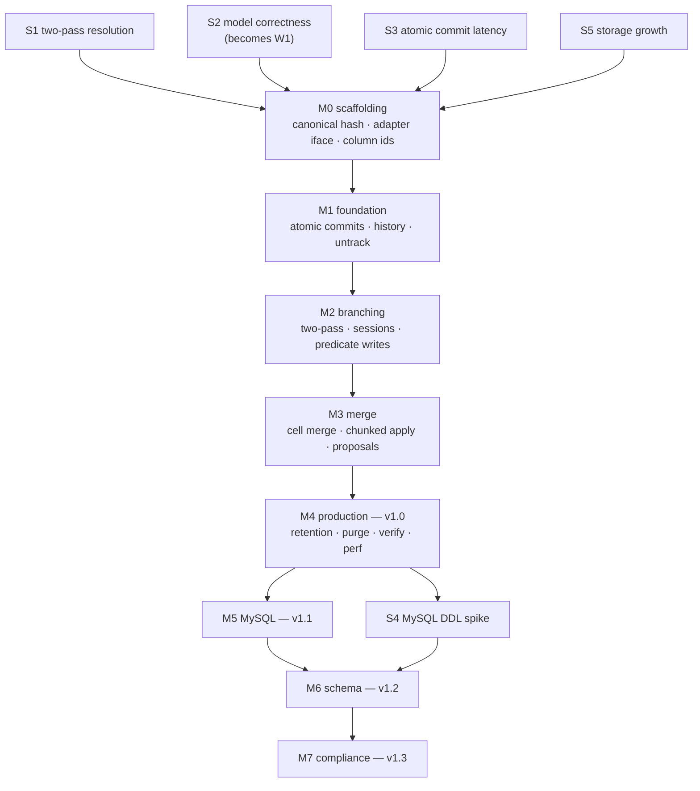

# DataGit — Implementation Plan

## Context

[DESIGN.md](DESIGN.md) specifies DataGit: a stateless Go service that adds Git-style version control (commits, branches, cell-level three-way merge, time travel, blame) to selected tables inside an application's existing PostgreSQL or MySQL database. The two driving use cases are **audit/compliance/rollback** and **collaborative data curation**; curation is the wedge (§1.1).

The repository is a specification: `README.md`, `DESIGN.md`, this plan, and `CLAUDE.md`, under git at `Glyph-Software/datagit`. No implementation code exists. This plan turns the design into an executable build sequence.

This revision follows a design review that found five contradictions in the original draft, all now fixed in DESIGN.md and reflected here: no uncommitted state on `main` (§6.1); predicate writes so the curation loop is expressible without a query engine (§7.4); two-pass resolution so filters cannot push into resolution arms (§7.3); crypto-shredding that leaves the live table plaintext (§13.3); and `UpdateFromParent` with fork-point advance so the segment chain stays a tree under DAG histories (§9.6). The review also re-cut v1.0 to PostgreSQL only, without schema merge or crypto-shredding (§20.2).

Four constraints from the design shape every decision below:

1. **`main` reads bypass DataGit** (§2, G2). The live table must always be a clean, schema-unmodified materialization of `main@HEAD`. This makes the overlay/sidecar model necessary and branch resolution the central performance risk.
2. **There is no uncommitted state on `main`** (§6.1). Every `main` commit is one atomic RPC. Sessions exist only on other branches.
3. **History lives in the user's own database** (§2). No content-addressed store. Correctness and performance are bounded by what one SQL engine does with interval predicates and indexes.
4. **Cell-level merge** (§9.2). Requires per-version column masks and a merge algorithm whose correctness cannot be established by example-based tests alone.

**Intended outcome:** a v1.0 service on PostgreSQL meeting the §14.1 targets as *measured*, with the riskiest assumptions falsified or confirmed before code is committed to them, followed by MySQL, schema merge, and compliance as v1.1–v1.3.

**Approach:** de-risk first via spikes, then build milestone by milestone. Correctness is established by **differential testing against an in-memory reference model**, seeded in Phase 0 and grown through every milestone.

**Toolchain present:** Go 1.25.1, Docker 29.4.3, protoc 34.0. **Missing:** `buf`, `psql`, `mysql` clients.

---

## How to read this plan

Work is expressed as **units with dependencies**, not as a schedule or an assignment to people. Any unit whose dependencies are met can start; [§Sequencing](#sequencing) shows what can proceed in parallel if there is capacity.

Milestones map to DESIGN.md §20.2 versions. Section references like §7.3 point into DESIGN.md.

---

## Phase 0 — De-risking spikes

**Purpose:** falsify the design's load-bearing assumptions before building on them. Phase 0 code is throwaway **except S2**, which becomes the permanent test harness.

Each spike has a pass criterion, a kill criterion, and a stated design fallback. A failed spike changes the design, which is cheaper now than in M3.

S1–S3 and S5 gate M1. **S4 gates M6 (schema), not M1** — MySQL DDL is not on the v1.0 path, and spiking it early would spend effort de-risking something two releases away.

### S1 — Branch resolution, two-pass *(highest risk)*

**Question:** Does the §7.3 two-pass resolution — candidate keys, then full resolution of exactly those keys — meet the targets on PostgreSQL, and how far behind is MySQL?

**Method:** Synthetic `datagit_v_products`: 50 M versions, ~10 M live keys, branch chains at depth 1, 3, and 8. Workloads: point read by PK; filtered scan at ~0.1 % selectivity *with* and *without* a per-column index on the filtered column; full branch scan; a read inside a session (priority −1 segment). `EXPLAIN ANALYZE` on PostgreSQL 17 and MySQL 8.4. Confirm the `DISTINCT ON` and `ROW_NUMBER()` forms return identical results.

**Also verifies (correctness):** both §7.3 hazards, demonstrated with the wrong form and the right form:
- A tombstone on a high-priority segment masks an inherited row; filtering `op <> 3` inside the arms resurfaces it.
- A branch edit that makes a row stop matching a filter is not resurfaced from the parent; pushing the filter into the arms resurfaces it.

**Pass (PostgreSQL, gates v1.0):** point read < 5 ms p95 at depth 3; filtered scan with a per-column index proportional to result size; filtered scan without one bounded by segment size, not table size; depth 8 within ~3× of depth 1.

**Pass (MySQL, informs v1.1):** measured and recorded. No gate. If MySQL is more than ~5× behind PostgreSQL on filtered scans, §7.6 materialized branch heads is pre-approved for the MySQL adapter.

**Kill:** PostgreSQL filtered scan at depth 3 on 10 M rows cannot beat ~100 ms with a per-column index.

**Fallback if killed:** §7.6 materialized branch heads become the *default* rather than a per-engine fallback. Trades O(1) branch creation (G4) for native-speed branch reads. Requires reworking §7.3 and §8.2 before M2.

### S2 — Version model correctness *(becomes permanent)*

**Question:** Are §9.2 cell-level merge, §7.3 resolution, §9.6 fork-point advance, and session isolation correct across the full case space, including cases the tables do not enumerate?

**Method:** Build the first `internal/model` — a pure, in-memory, deliberately naive reference implementation of commits, refs, sessions, resolution, diff, merge, and `UpdateFromParent`. Build the real cell-merge algorithm. Fuzz: random operation sequences (insert/update/delete/`UpdateWhere` across two or more branches and sessions from a common base, interleaved with `UpdateFromParent`), run both, assert identical resolved state, merge results, and conflict sets.

**Pass:** 10 M random sequences with zero divergence; every row of the §9.2 table covered by a generated case, verified by coverage assertion; every standing invariant in [§Verification](#verification) exercised.

**Kill:** none — this must work. Divergence means the algorithm or the model is wrong, and both are fixed until they agree.

**Output:** `internal/model` and `test/property` survive Phase 0 and are the correctness backbone for every later milestone.

### S3 — Atomic commit latency and amplification

**Question:** Does the §6.1 single-RPC commit — ref lock, PK-ordered `FOR UPDATE`, live writes, sidecar writes, commit record, one transaction — stay within < 5 ms added p99 for small commits, and how does it scale with change-set size?

**Method:** Against Dockerized PostgreSQL: raw `UPDATE` baseline vs. the full commit transaction at change-set sizes 1, 10, 100, 1 000; at 1, 10, and 100 concurrent committers; with and without overlapping key sets (contention on the ref lock and on rows). Measure write amplification against the predicted 2–3×.

**Pass:** < 5 ms added p99 for a single-row commit at 100 concurrent committers on disjoint keys; amplification ≤ 3×; latency linear in change-set size.

**Fallback if missed:** for `audit` tier only, an asynchronous capture path that gives up the §11.1 atomicity guarantee for that tier, documented as a tier difference. `versioned` tier keeps atomicity regardless.

### S4 — MySQL resumable migration apply *(gates M6, not M1)*

**Question:** Does the §10.4 journalled state machine survive crashes without transactional DDL?

**Method:** A minimal 4-operation migration (add column, backfill, add index, drop column) as journalled idempotent steps. Kill at every step boundary and mid-step, restart, assert convergence. Repeat on PostgreSQL to confirm identical behaviour.

**Pass:** convergence from every injected crash point without manual intervention.

**Fallback:** restrict MySQL to additive and widening operations in v1.2; narrowing and destructive become PostgreSQL-only, recorded in the §4.3 matrix.

### S5 — Storage growth and pruning

**Question:** Is the §5.2c storage estimate — ~2× data plus indexes, 3–4× at rest before history — real, and does partition-drop pruning work?

**Method:** Load a representative table, enable `versioned` tracking, apply a realistic churn profile. Measure sidecar data and index size vs. base. Partition by `(branch_id, seq_from)`, run retention pruning, compare partition drop to row delete.

**Pass:** ≤ 4× at rest excluding history; partition drop at least an order of magnitude faster than `DELETE`.

**Fallback if missed:** value-level deduplication for large columns (§20.1 Q6) moves from open question to a required v1.0 item.

### Phase 0 exit criteria

- S1, S3, S5 pass, or their fallbacks are adopted into DESIGN.md **before M1 starts**.
- S2's reference model and property harness are merged and running in CI.
- DESIGN.md §14.1 targets are replaced with measured PostgreSQL numbers, relabelled as measured.
- S4 is scheduled before M6 and its result recorded before M6 starts.

---

## M0 — Scaffolding

Everything downstream depends on this. Small, but two items in it are irreversible.

| Unit | Detail |
|---|---|
| **M0.1 Repository** | Go module `github.com/Glyph-Software/datagit`; Apache 2.0 licence; `.gitignore`; CI (build, vet, `golangci-lint`, unit, race detector). |
| **M0.2 Dev environment** | `docker-compose.yml` with PostgreSQL 16 **and** 17 (MySQL 8.4 added in M5). Makefile targets: `test`, `test-integration`, `test-property`, `test-crash`, `test-acceptance`, `verify-parity`, `bench`, `lint`, `proto`. Install `buf`. |
| **M0.3 Layout** | Directory structure below; package boundaries enforced by lint from day one. |
| **M0.4 Canonical encoding — IRREVERSIBLE** | Freeze the canonical value encoding and `commit_id` construction (§12.1), versioned `datagit.commit.v1`. Golden-file tests pin the hash of a fixed change set forever. **Changing this after any history exists invalidates every commit hash ever written.** |
| **M0.5 Adapter interface — IRREVERSIBLE-ish** | Define `Adapter` (§4.3) and the `Caps` matrix, including the supported-type list (§10.5 rule 5) and the materialized-heads flag (§7.6). Every engine difference must be expressible through it. |
| **M0.6 Reference model** | Promote S2's `internal/model` into the tree with the property harness wired into CI. |

### Repository layout

```
datagit/
├── api/proto/datagit/v1/     # protobuf; buf-generated
├── cmd/
│   ├── datagitd/             # server
│   └── datagit/              # CLI — the reference client; restricted-SQL parser lives here
├── internal/
│   ├── adapter/              # Adapter iface + postgres/ (+ mysql/ in M5)
│   ├── catalog/              # repos, tables, tracking, sidecar DDL, column ids
│   ├── version/              # commits, refs, hash chain
│   ├── session/              # sessions, leases, staged-row lifecycle
│   ├── sidecar/              # interval reads/writes, changed_cols masks
│   ├── resolve/              # segment chains, two-pass resolution query builder
│   ├── expr/                 # filter AST + assignment grammar → parameterized SQL
│   ├── diff/
│   ├── merge/                # base, cell merge, conflicts, validation, atomic + chunked apply
│   ├── schemaeng/            # M6: schema diff/merge, planner, apply state machine
│   ├── crypto/               # M7: DEK lifecycle, envelope, crypto-shred
│   ├── retention/            # policies, GC, purge, verify, export
│   ├── auth/                 # principals, capabilities, branch protection
│   ├── server/               # gRPC + grpc-gateway, idempotency, errors
│   └── model/                # reference implementation (test-only dependency)
├── pkg/sdk/go/
├── sdk/{typescript,python}/  # M7
├── test/{property,integration,bench,acceptance,crash}/
├── deploy/{helm,compose}/
└── docs/
```

**Package rule:** `internal/model` must never be imported by non-test code. Enforced by lint. A reference model that shares code with the implementation tests nothing.

---

## M1 — Foundation *(v0.1, PostgreSQL)*

No branching. The goal is a complete, atomic, attributable history with no uncommitted state on `main`.

| Unit | Design ref | Notes |
|---|---|---|
| **M1.1 Control schema** | §5.3 | `datagit_repo/table/commit/ref/session/idempotency` + `datagit_migration_journal`. DataGit's own control-schema migrations run through the journalled state machine (§17.2) — dogfooded from the start. Control-schema version guard on startup. |
| **M1.2 Catalog & sidecar DDL** | §5.2, §10.5 | Typed sidecars from live-table introspection with **stable column ids** (`c_<id>`) from day one — retrofitting ids later would be a sidecar rewrite. PK detection; refuse `versioned` without a stable PK (§3.2); refuse unmirrorable types naming the column (§10.5 rule 5). Four required indexes. |
| **M1.3 Online backfill** | §6.4 | Chunked by PK range, rate-limited, resumable; skips keys that already have a version. Root commit labelled `import`. |
| **M1.4 Atomic commit RPC** | §6.1 | The critical unit. One RPC, one transaction: ref lock → `expected_head` check → PK-ordered `FOR UPDATE` → live writes → close/insert versions → commit record → advance ref. Per-row `expected_version_id`. Idempotency keys via `datagit_idempotency` (§16.2). **No staged rows on `main`, ever.** |
| **M1.5 Hash chain** | §12.1 | Merkle `change_digest`; `commit_id` per M0.4. |
| **M1.6 Time travel, history, blame** | §7.2 | Interval queries on `main`; timestamp → commit by `committed_at` (DB clock, monotonic per branch). Per-cell blame walks `changed_cols` by column id. |
| **M1.7 Two-point diff** | §8.1 | Boundary-crossing interval scan; paginated by PK; streams. |
| **M1.8 Revert** | §16.1 | A new commit that undoes. Erases nothing. |
| **M1.9 Minimal auth** | §15.2 | API keys (Argon2id), principals, **server-assigned commit author**. Full RBAC in M3. |
| **M1.10 gRPC + REST** | §16.1 | `Repository`, `Data` (reads), `Version` services. Typed errors; streaming. |
| **M1.11 Drift & schema-drift detection** | §6.3, §10.5 | `open` mode default; `verify --drift`. Re-introspect on touch; additive/widening sidecar evolution automatic; `SCHEMA_DRIFT` for anything else. Trigger modes deferred to M4. |
| **M1.12 Untrack & export** | §17.5 | Refuse with unmerged branch changes (no-op in M1, wired for M2); JSONL export in canonical encoding; sidecar drop. The exit door exists before anyone walks in. |
| **M1.13 CLI + Go SDK** | §7.4, §16.3 | SDK buffers client-side and sends one `Commit`. CLI: `init`, `track`, `untrack`, `export`, restricted-grammar `sql` (INSERT/UPDATE/DELETE by PK only until M2), `commit`, `log`, `diff`, `blame`, `read --at`, `revert`, `verify`. |

**Exit:** the README's audit-facing examples run verbatim against PostgreSQL. Property harness covers commit/time-travel/blame and invariants 1, 5, 6, 8. `main` read latency measurably unchanged.

---

## M2 — Branching *(v0.2, PostgreSQL)*

| Unit | Design ref | Notes |
|---|---|---|
| **M2.1 Refs** | §5.3 | Branches and tags; fork points; O(1) creation; segment depth capped at 8. |
| **M2.2 Two-pass resolution** | §7.3 | S1's validated shape behind `ResolveQuery`. Both §7.3 hazards are property-test invariants (3 and 10), not unit tests. |
| **M2.3 Filter AST & assignment grammar** | §7.4, §15.4 | `internal/expr`: typed predicate tree and the assignment grammar (constants, columns, arithmetic, concat, `COALESCE`, `CASE`) → parameterized SQL. **Security-critical:** no user input reaches SQL as text; identifiers validated against the catalogue. Standing injection fuzz. |
| **M2.4 Direct branch commits** | §6.2 | Sidecar-only. Property test: live table byte-identical before and after arbitrary branch activity (invariant 2). |
| **M2.5 Sessions** | §6.2 | `OpenSession`, streamed `Write`, `RenewLease`, `CommitSession`, `AbandonSession`. Priority −1 segment for in-session reads. Lease expiry → GC of staged rows. Property test: staged rows invisible outside the session (invariant 9). |
| **M2.6 Predicate writes** | §7.4 | `UpdateWhere`/`DeleteWhere`: two-pass resolve → evaluate assignments → per-key change set. Property test: identical change set to the equivalent list of `Update` calls. CLI `sql` grammar extended to `WHERE`. |
| **M2.7 Merge base (LCA)** | §9.1 | Bidirectional BFS. **Multiple bases refused with candidates named.** |
| **M2.8 Cross-branch diff** | §8.2 | Segment-chain walk from base; sibling case. |
| **M2.9 UpdateFromParent** | §9.6 | Three-way merge branch-as-target, then fork-point advance and lazy overlay pruning. Property test: post-update resolution equals the merge result; the chain is still a tree (invariant 11). Needs M3.1's cell merge — ships when M3.1 does; the ref bookkeeping is built here. |
| **M2.10 Materialization** | §7.5 | Resolution into a real schema; tracked, TTL'd, GC'd. |

**Exit:** branch, session, predicate write, diff, and materialize work on PostgreSQL. Property harness extended to multi-branch, multi-session resolution.

---

## M3 — Merge *(v0.3, PostgreSQL)*

The correctness-critical milestone. S2's harness is the primary evidence.

| Unit | Design ref | Notes |
|---|---|---|
| **M3.1 Cell-level three-way merge** | §9.2 | Full case table; disjointness via `changed_cols` AND over column ids. **Delete/modify is always a conflict.** Unblocks M2.9. |
| **M3.2 Conflict persistence** | §9.4 | `datagit_conflict`. Survives restart, redeploy, and a reviewer's weekend. |
| **M3.3 Constraint validation** | §9.3 | Staging relation → PK, unique, check, intra-repo FK → violations as first-class conflicts. FK-to-non-versioned remains a stated sharp edge; apply-time failure rolls back atomically with the engine error attached. |
| **M3.4 Atomic apply** | §9.5 | Ref lock → re-verify head → apply → versions → two-parent commit → advance ref. One transaction. Enforces the atomic apply limit; `MERGE_TOO_LARGE` above it. |
| **M3.5 Chunked apply** | §9.5 | Opt-in; `merge_in_progress` on the ref; PK-ordered journalled chunks; resumable. Crash-injection tested. |
| **M3.6 Proposals** | §16.1 | Create, diff, comment, approve, conflicts, merge. `open → conflicted → approved → merged/closed`. |
| **M3.7 Full RBAC & branch protection** | §15.3 | Seven capabilities; **`purge` separate from `admin`**. Protection: require proposal, N approvals, no self-approval, restricted mergers, source up to date (via M2.9). |

**Exit:** property harness runs randomized multi-branch curation scenarios end-to-end, asserting model equivalence for merge results *and* conflict sets, including `UpdateFromParent` cycles.

---

## M4 — Production *(v1.0, PostgreSQL)*

| Unit | Design ref | Notes |
|---|---|---|
| **M4.1 Retention policies** | §13.1 | Age, depth, density thinning; protected commits never pruned; **thinned periods keep a marker**. |
| **M4.2 GC** | §13.2 | Branch-deletion grace period; expired sessions; materialization TTLs; bounded batches; advisory-lock leader. |
| **M4.3 Hard purge** | §13.4 | Elevated capability + reason; tombstone; **`integrity = 'purged'`, never re-hashed.** |
| **M4.4 Verify, three modes** | §17.3 | `--drift`, `--integrity`, `--intervals`. |
| **M4.5 Partitioning** | §14.3 | `(branch_id, seq_from)` range partitions; pruning by partition drop. |
| **M4.6 Performance** | §14.1 | Benchmarks as CI regression gates against measured targets. Prepared-statement cache keyed `(table, schema_epoch, segment_count)`; replica routing for historical reads. |
| **M4.7 Trigger modes** | §6.3 | `guarded` and `capture`, with cost measured and documented; the guard marker documented as a seatbelt, not a lock. |
| **M4.8 Observability** | §17.3 | Metrics incl. resolution segment depth and session count; OTel traces; liveness/readiness. |
| **M4.9 OIDC** | §15.2 | JWT claims → principals; mTLS optional; operation audit log. |
| **M4.10 Deployment** | §17.1 | Distroless image; Helm chart; compose; control-schema guard. |
| **M4.11 Docs** | — | Getting started (leading with curation), tracking guide, merge/conflict guide, sessions guide, operations runbook, the v1.0 schema limitation stated plainly. |

**Exit:** v1.0 tagged. README's full tour runs verbatim. All §14.1 targets measured on PostgreSQL 16 and 17.

---

## M5 — MySQL *(v1.1)*

| Unit | Design ref | Notes |
|---|---|---|
| **M5.1 Adapter** | §4.3 | `ROW_NUMBER()` two-pass resolution; `GET_LOCK` with defer + dead-session reaper; `AUTO_INCREMENT`; `varbinary` masks; plain session index; per-engine supported-type list. |
| **M5.2 Parity gate** | W2 | Every integration and acceptance test runs on both engines from here on, asserting identical results. |
| **M5.3 Measured targets** | §14.1, §7.6 | Run the full benchmark suite; publish MySQL targets from measurement. Enable materialized branch heads for MySQL if S1's threshold was crossed. |
| **M5.4 Compose & docs** | — | MySQL 8.4 in `docker-compose.yml`; engine-difference matrix published. |

---

## M6 — Schema *(v1.2, both engines)*

**Gated by S4.**

| Unit | Design ref | Notes |
|---|---|---|
| **M6.1 Schema versioning** | §10.1 | `datagit_schema_version` + digest; `schema_epoch` on commits. |
| **M6.2 Historical projection** | §10.1 | Column added after `c` reads as *absent* at `c`; dropped columns readable in history. |
| **M6.3 Schema diff** | §10.2 | Structural; **renames only when declared**. |
| **M6.4 Schema merge** | §10.3 | Full matrix; runs before data merge. |
| **M6.5 Migration planner** | §10.4 | Additive / widening / narrowing / destructive; pre-flight scans; two-phase drops. |
| **M6.6 Resumable apply** | §10.4 | S4's state machine, productionized; **identical on both engines**. |
| **M6.7 Full sidecar evolution** | §10.5 | Narrowing forks to new column ids; append-only sidecar columns; generated-column rules; `changed_cols` width per epoch. Replaces M1.11's additive-only path. |

**Exit:** crash-injection passes at every step boundary on both engines. Schema flows branch → proposal → plan → apply → live table.

---

## M7 — Compliance *(v1.3)*

| Unit | Design ref | Notes |
|---|---|---|
| **M7.1 Crypto-shredding** | §13.3 | PII designation; per-subject DEK under KMS envelope; **sidecar-only encryption, live table plaintext**; `EraseSubject` = live-row deletion commit + DEK destruction + erasure-fact commit; `erased` markers on historical reads. |
| **M7.2 External anchoring** | §12.3 | Signed checkpoints to WORM storage. |
| **M7.3 Commit signing** | §12.3 | Optional Ed25519. |
| **M7.4 SDKs** | §16 | TypeScript and Python, generated from proto with ergonomic layers. |

**Exit:** an erasure completes end-to-end with the hash chain still verifying and direct readers unaffected throughout.

---

## Cross-cutting workstreams

| ID | Workstream | Spans | Rule |
|---|---|---|---|
| **W1** | Reference model + property harness | S2 → M7 | Every milestone extends the model *before* the implementation. If the model can't express a feature, the feature isn't specified well enough to build. |
| **W2** | Adapter parity | M5 → M7 | From M5, nothing is done until it passes on both engines. Genuine differences go in the §4.3 matrix; performance gaps are measured and published, never hidden there. |
| **W3** | Hash stability | M0 → forever | Golden tests pin canonical encoding. Any change is a new version tag with a migration story. |
| **W4** | Security | M1 → M7 | Standing injection fuzz against the filter AST and assignment grammar; every statement parameterized; role separation verified by test. |
| **W5** | Acceptance-as-docs | M1 → M7 | `test/acceptance` runs the README examples verbatim. |

---

## Sequencing



**Genuinely parallelizable** once M1 lands: M2.3 (expression grammar) with M2.1–M2.2; M2.10 (materialization) with M2.5–M2.9; M4.8–M4.11 with M4.1–M4.6; M5 with M6.1–M6.3 once M4 is tagged; S4 any time after M0.

**Strictly serial:** M0.4 → everything. M2.2 → M2.6 → M2.9. M3.1 → M2.9 → M3.7 (source-up-to-date rule). M3.4 → M3.5. S4 → M6.6.

---

## Open questions to close, and when

DESIGN.md §20.1 lists seven. Each blocks a milestone and is decided at that boundary, not drifted past.

| Question | Blocks | Recommendation |
|---|---|---|
| Q3 — tables without a stable PK | **M1.2** | Refuse `versioned` mode. A surrogate-identity mode with degraded merge is worse than an honest refusal. |
| Q6 — large values | **M4.5** | Decide against S5's measured numbers. |
| Q2 — primary-key changes | **M3.1** | Keep delete + insert for v1.0. Revisit only with real demand. |
| Q1 — multiple merge bases | **M3.4** | Keep the refusal. Recursive base merging is deferred, not approximated. |
| Q7 — deterministic encryption for PII search | **M7.1** | Opt-in per column with the equality leak documented. Never a default. |
| Q4, Q5 — federation, push/pull | post-v1.3 | No action. |

---

## Verification

| Layer | Command | What it establishes |
|---|---|---|
| Unit | `make test` | Package-level logic, race detector on. |
| **Property / model-based** | `make test-property` | **The primary correctness evidence.** Random operation sequences against both the reference model and the real implementation; resolved state, merge results, and conflict sets must match. Seed corpus committed; failures minimized and added permanently. |
| Integration | `make test-integration` | Dockerized PostgreSQL 16 + 17 (MySQL 8.4 from M5). Real DDL, constraints, transactions. |
| Parity | `make verify-parity` | Identical scenarios on both engines, asserting identical results. From M5. |
| Crash injection | `make test-crash` | Kill at every journal step: chunked apply (M3.5), migration apply (M6.6). Assert convergence. |
| Benchmarks | `make bench` | Measured §14.1 targets as regression gates. |
| Acceptance | `make test-acceptance` | README examples verbatim. |
| Drift | part of integration | Out-of-band data write → `verify --drift` detects; out-of-band non-additive DDL → `SCHEMA_DRIFT`. |

**Standing invariants asserted by the property harness** — the design's real contract:

1. The live table is byte-identical to `main@HEAD` after any sequence of operations.
2. Arbitrary activity on non-`main` branches, including sessions, leaves the live table untouched.
3. A tombstone on a high-priority segment always masks an inherited row (§7.3).
4. Every sidecar has exactly one open version per key per branch — no overlaps, no gaps.
5. Recomputing the hash chain over any history reproduces every stored `commit_id`.
6. A commit's changes are all visible or none are.
7. Crypto-shredding a subject leaves the hash chain verifying and the live table readable (M7).
8. No sidecar row on `main` ever carries the zero commit hash or a `session_id`.
9. A session's staged rows are invisible to every read that does not name the session.
10. A filtered branch read returns exactly the filter applied to the full resolution (§7.3 two-pass).
11. After `UpdateFromParent`, resolution of the branch equals the merge result and the segment chain is still a tree (§9.6).
12. `UpdateWhere` produces exactly the change set of the equivalent per-key `Update` calls (§7.4).

---

## Risk register

| Risk | Severity | Mitigation | Owner |
|---|---|---|---|
| Two-pass resolution too slow at depth/scale | **Critical** — invalidates the storage model | S1 with a stated fallback to materialized branch heads | S1 |
| Merge, resolution, or session isolation silently wrong | **Critical** — destroys trust | Differential testing against a reference model from day one; invariants 3, 9, 10, 11 | S2 / W1 |
| Filter pushed into resolution arms by a future optimization | High — silent wrong results | Invariant 10 in the harness; §7.3 warning; code review checklist | M2.2 |
| Canonical hash changed after history exists | High — irreversible | Frozen and golden-tested in M0.4 | M0.4 / W3 |
| Column ids not present from the first sidecar | High — later retrofit is a rewrite | Stable ids in M1.2, before any tracked table exists | M1.2 |
| Large merge stalls production | High | Atomic apply limit; opt-in chunked apply with visible flag | M3.4 / M3.5 |
| Session rows leak past lease | Medium | GC reaps expired sessions; invariant 9; session count metric | M2.5 / M4.2 |
| SQL injection via filter AST or assignment grammar | High | Typed AST, no string path; standing fuzz | M2.3 / W4 |
| MySQL optimizer far behind on resolution | Medium (v1.1) | S1 measures it early; §7.6 fallback pre-approved | S1 / M5.3 |
| MySQL DDL failure leaves indeterminate state | High (v1.2) | S4 before M6; journalled idempotent state machine | S4 / M6.6 |
| Storage 3–4× surprises adopters | Medium | Stated in README and §3.4; S5 measures; retention | S5 / M4.1 |
| Typed sidecar evolution brittle | Medium | Column ids + append-only rules; additive-only until M6 | M1.2 / M6.7 |
| Adoption stalls on the write-path rewrite | **Strategic** | §1.1 states the cost and the realistic adopter; docs lead with the walled-off subsystem pattern; untrack/export from M1 so trying it is cheap | M4.11 / M1.12 |
| DEK loss indistinguishable from erasure | Medium (v1.3) | KMS-backed durability only | M7.1 |

---

## Explicitly deferred

Rebase (rewrites hashes; forbidden by the audit use case) · cherry-pick · bitemporality (§19.7) · push/pull between instances · multi-tenancy (§15.1) · review UI (API-complete in M3) · recursive merge-base resolution · cross-repository federation.

Each is named here so that scope creep has to be a decision rather than a drift.
