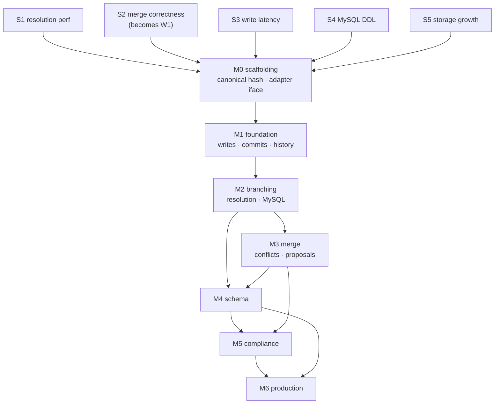

# DataGit — Implementation Plan

## Context

[DESIGN.md](DESIGN.md) specifies DataGit: a stateless Go service that adds Git-style version control (commits, branches, cell-level three-way merge, time travel, blame) to selected tables inside an application's existing PostgreSQL or MySQL database. The two driving use cases are **audit/compliance/rollback** and **collaborative data curation**.

The design is complete but **entirely unbuilt** — the repository contains only `README.md` and `DESIGN.md`, and is not yet a git repository. This plan turns the design into an executable build sequence.

Three constraints from the design shape every decision below:

1. **`main` reads bypass DataGit** (§2, G2). The live table must always be a clean, schema-unmodified materialization of `main@HEAD`. This is what makes the overlay/sidecar storage model necessary and what makes branch resolution the central performance risk.
2. **History lives in the user's own database** (§2). No content-addressed store, no prolly trees. Correctness and performance are bounded by what one SQL engine can do with interval predicates and indexes.
3. **Cell-level merge** (§9.2). Requires per-version column masks and a merge algorithm whose correctness cannot be established by example-based tests alone.

**Intended outcome:** a v1.0 service meeting the §14.1 performance targets, with the riskiest assumptions falsified or confirmed *before* significant code is committed to them.

**Approach chosen:** de-risk first via throwaway spikes, then build milestone by milestone. Correctness is established by **differential testing against an in-memory reference model**, seeded in Phase 0 and grown through every milestone.

**Toolchain present:** Go 1.25.1, Docker 29.4.3, protoc 34.0. **Missing:** `buf`, `psql`, `mysql` clients, git repository.

---

## How to read this plan

Work is expressed as **units with dependencies**, not as a schedule or an assignment to people. Any unit whose dependencies are met can start; the dependency graph in [§Sequencing](#sequencing) shows what can proceed in parallel if there is capacity to do so.

Each milestone maps to a version in DESIGN.md §20.2. Section references like §7.3 point into DESIGN.md.

---

## Phase 0 — De-risking spikes

**Purpose:** falsify the design's four load-bearing assumptions before building on them. All Phase 0 code is throwaway **except S2**, which becomes the permanent test harness.

Each spike has an explicit kill criterion and a stated design fallback. A spike that fails does not stop the project — it changes the design, which is cheaper now than in M3.

### S1 — Branch resolution performance *(highest risk)*

**Question:** Does the §7.3 priority-fallthrough resolution query hold up at scale on both engines?

**Method:** Generate a synthetic `datagit_v_products` — 50 M versions, ~10 M live keys, branch chains at depth 1, 3, and 8. Run: point read by PK; selective scan (`category = ?`, ~0.1% selectivity); full branch scan. `EXPLAIN ANALYZE` on PostgreSQL 17 and MySQL 8.4. Verify the `DISTINCT ON` and `ROW_NUMBER()` forms produce identical results.

**Also verifies (correctness, not performance):** the delete-fallthrough hazard flagged in §7.3 — an `op = 3` tombstone on a high-priority segment must mask an inherited row. Filtering `op <> 3` inside the union arms instead of outside is the bug; the spike must demonstrate the failure with the wrong form and its absence with the right one.

**Pass:** point read < 5 ms p95 at depth 3; selective scan uses the `(branch_id, pk, seq_from DESC)` index rather than degrading to a full scan; depth 8 within ~3× of depth 1.

**Kill:** if depth-3 selective scan on 10 M rows cannot beat ~100 ms, on-the-fly resolution is not viable.

**Fallback if killed:** maintain a **materialized resolution table per branch head**, updated incrementally on branch write. Trades O(1) branch creation (violating G4) for native-speed branch reads. Would require reworking §7.3 and parts of §8.2 before M2.

### S2 — Merge correctness *(becomes permanent)*

**Question:** Is the §9.2 cell-level merge algorithm correct across the full case space, including cases the table does not enumerate?

**Method:** Build the first version of `internal/model` — a pure, in-memory, deliberately naive reference implementation of commits, refs, resolution, diff, and merge. Build the real cell-merge algorithm. Fuzz: generate random operation sequences (insert/update/delete across two branches from a common base), run both, assert identical merge results and identical conflict sets.

**Pass:** 10 M random operation sequences with zero divergence; every row of the §9.2 table covered by a generated case, verified by coverage assertion rather than by hand.

**Kill:** none — this must work. Divergence means the algorithm or the model is wrong, and both get fixed until they agree.

**Output:** `internal/model` and `test/property` survive Phase 0 and become the correctness backbone for M2–M5.

### S3 — Write-path latency and amplification

**Question:** Does the §6.1 single-transaction live-write + sidecar-write stay within the < 5 ms added p99 target (§14.1)?

**Method:** Benchmark against Dockerized PostgreSQL and MySQL: raw `UPDATE` baseline vs. the full DataGit transaction (`SELECT FOR UPDATE` → live `UPDATE` → close open version → insert new open version). Measure at 1, 10, and 100 concurrent writers, with and without row contention. Measure actual write amplification against the predicted 2–3×.

**Pass:** < 5 ms added p99 uncontended at 100 writers; amplification ≤ 3×.

**Fallback if missed:** batch the sidecar writes within a commit (already planned in §14.3), or move `audit`-tier capture to an asynchronous path — accepting the loss of the §11.1 atomicity guarantee for that tier only, which must then be documented as a tier difference.

### S4 — MySQL resumable migration apply

**Question:** Does the §10.4 journalled state machine actually survive crashes without transactional DDL?

**Method:** Implement a minimal 4-operation migration (add column, backfill, add index, drop column) as journalled idempotent steps. Kill the process at every step boundary and mid-step, restart, assert convergence to the same final state. Repeat on PostgreSQL to confirm identical behaviour.

**Pass:** convergence from every injected crash point; no manual intervention required.

**Fallback if it fails:** restrict MySQL to additive and widening operations only in v1.0; narrowing and destructive changes become PostgreSQL-only, documented as an engine capability difference in the §4.3 matrix.

### S5 — Storage growth and pruning

**Question:** Is the ~2× storage claim (§5.2d, §14.2) real, and does partition-drop pruning work?

**Method:** Load a representative table, enable `versioned` tracking, apply a realistic churn profile. Measure sidecar size vs. base. Partition by `(branch_id, seq_from)`, run retention pruning, measure reclaim time for partition drop vs. row delete.

**Pass:** ≤ 2.5× at rest excluding history; partition drop at least an order of magnitude faster than `DELETE`.

**Fallback if missed:** value-level content-addressed deduplication for large columns (§20.1 Q6) moves from "open question" to a required M5 item.

### Phase 0 exit criteria

- S1, S3, S4, S5 pass, or their fallbacks are adopted into DESIGN.md **before M1 starts**.
- S2's reference model and property harness are merged and running in CI.
- DESIGN.md is amended with measured numbers replacing the §14.1 *targets*, clearly relabelled as measured.

---

## M0 — Scaffolding

Everything downstream depends on this. Small, but two items in it are irreversible.

| Unit | Detail |
|---|---|
| **M0.1 Repository** | `git init`; Go module `github.com/<org>/datagit`; Apache 2.0 licence; `.gitignore`; CI (build, vet, `golangci-lint`, unit, race detector). |
| **M0.2 Dev environment** | `docker-compose.yml` with PostgreSQL 16 **and** 17 and MySQL 8.4. Makefile targets: `test`, `test-integration`, `test-property`, `bench`, `lint`, `proto`. Install `buf` (missing). |
| **M0.3 Layout** | Directory structure below, with package boundaries enforced by lint rules from day one. |
| **M0.4 Canonical encoding — IRREVERSIBLE** | Freeze the canonical value encoding and `commit_id` hash construction (§12.1), versioned `datagit.commit.v1`. Golden-file tests pin the hash of a fixed change set forever. **Changing this after any history exists invalidates every commit hash ever written.** It must be settled here, not discovered in M1. |
| **M0.5 Adapter interface — IRREVERSIBLE-ish** | Define `Adapter` (§4.3) and the `Caps` matrix. Every engine difference in the design must be expressible through it. Reworking this later touches every package. |
| **M0.6 Reference model** | Promote S2's `internal/model` into the tree with the property harness wired into CI. |

### Repository layout

```
datagit/
├── api/proto/datagit/v1/     # protobuf; buf-generated
├── cmd/
│   ├── datagitd/             # server
│   └── datagit/              # CLI — the reference client
├── internal/
│   ├── adapter/              # Adapter iface + postgres/ + mysql/
│   ├── catalog/              # repos, tables, tracking, sidecar DDL
│   ├── version/              # commits, refs, working sets, hash chain
│   ├── sidecar/              # interval reads/writes, changed_cols masks
│   ├── resolve/              # segment chains, resolution query builder
│   ├── diff/
│   ├── merge/                # base, cell merge, conflicts, validation, apply
│   ├── schemaeng/            # schema diff/merge, planner, apply state machine
│   ├── crypto/               # DEK lifecycle, envelope, crypto-shred
│   ├── retention/            # policies, GC, purge, verify
│   ├── auth/                 # principals, capabilities, branch protection
│   ├── server/               # gRPC + grpc-gateway, idempotency, errors
│   └── model/                # reference implementation (test-only dependency)
├── pkg/sdk/go/
├── sdk/{typescript,python}/
├── test/{property,integration,bench,acceptance}/
├── deploy/{helm,compose}/
└── docs/
```

**Package rule:** `internal/model` must never be imported by non-test code. Enforced by lint. A reference model that shares code with the implementation tests nothing.

---

## M1 — Foundation *(DESIGN.md v0.1)*

PostgreSQL only. No branching. The goal is a complete, atomic, attributable history.

| Unit | Design ref | Notes |
|---|---|---|
| **M1.1 Control schema** | §5.3 | `datagit_repo/table/commit/ref/working_set` + `datagit_migration_journal`. DataGit's own schema migrations run through the same journalled state machine as user migrations (§17.2) — dogfooded from the start. Control-schema version guard on startup. |
| **M1.2 Catalog & sidecar DDL** | §5.2 | Generate typed sidecars from live-table introspection. PK detection; **refuse `versioned` mode without a stable PK** (§3.2). Three required indexes, no more. |
| **M1.3 Online backfill** | §6.4 | Chunked by PK range, rate-limited, resumable, concurrent-write safe. Root commit honestly labelled `import`. |
| **M1.4 Write path** | §6.1 | The critical unit. Single transaction: `FOR UPDATE` → live write → close open version → insert new open version. Compute `changed_cols`. Idempotency keys (§16.2). |
| **M1.5 Working set & commit** | §5.3, §6.1 | Staged rows carry the zero hash; commit stamps them, appends `datagit_commit`, advances the ref — one transaction, under a ref advisory lock. Commit cost proportional to the change, never to the table. |
| **M1.6 Hash chain** | §12.1 | Merkle `change_digest` over the sorted change set; `commit_id` per M0.4. |
| **M1.7 Time travel, history, blame** | §7.2 | Interval queries on `main`. Per-cell blame walks `changed_cols` back through the version chain. |
| **M1.8 Two-point diff** | §8.1 | Boundary-crossing interval scan. Paginated by PK; streams. |
| **M1.9 Revert** | §16.1 | A *new* commit that undoes a prior one. Erases nothing. |
| **M1.10 Minimal auth** | §15.2 | API keys (Argon2id), principals, **server-assigned commit author**. Client-supplied authorship is never accepted — an audit trail with a client-controlled author field is decoration. Full RBAC lands in M3. |
| **M1.11 gRPC + REST** | §16.1 | `Repository`, `Data`, `Version` services. Typed errors; streaming for unbounded results. |
| **M1.12 Drift detection** | §6.3 | `open` mode default; `datagit verify --drift` scans live table vs `main@HEAD`. `guarded`/`capture` trigger modes deferred to M6. |
| **M1.13 CLI + Go SDK** | §16.3 | `init`, `track`, write ops, `commit`, `log`, `diff`, `blame`, `read --at`, `revert`, `verify`. The CLI is the reference client and must exercise every endpoint. |

**Exit:** the README's audit-facing examples run verbatim against real PostgreSQL. Property harness covers write/commit/time-travel/blame. `main` read latency measurably unchanged.

---

## M2 — Branching *(v0.2)*

| Unit | Design ref | Notes |
|---|---|---|
| **M2.1 Refs** | §5.3 | Branches and tags; fork points; O(1) creation; **segment depth capped at 8** with creation refused beyond it (§18). |
| **M2.2 Segment chain & resolution** | §7.3 | Built on S1's validated query shape. Both engine forms behind `ResolveQuery`. Delete-fallthrough correctness is a dedicated property-test invariant, not a unit test. |
| **M2.3 Branch writes** | §6.2 | Sidecar-only. A property test must assert the live table is byte-identical before and after arbitrary branch activity. |
| **M2.4 Merge base (LCA)** | §9.1 | Bidirectional BFS. **Multiple bases are refused with candidates named** — never silently resolved. |
| **M2.5 Cross-branch diff** | §8.2 | `ΔA`/`ΔB` against the base; per-table, per-row, per-cell output. |
| **M2.6 Structured read API** | §7.4, §15.4 | Typed filter AST → parameterized SQL. **Security-critical:** no user input ever reaches SQL as text; identifiers validated against the catalogue and quoted by the adapter. Fuzz for injection as a standing test. |
| **M2.7 Materialization** | §7.5 | Resolution into a real schema, with the branch's indexes. Tracked, TTL'd, GC'd. |
| **M2.8 MySQL adapter** | §4.3 | Full parity: `ROW_NUMBER()` resolution, `GET_LOCK` with defer + dead-session reaper, `AUTO_INCREMENT`, `varbinary` masks. **Parity gate:** every integration test runs on both engines and asserts identical results from here on. |

**Exit:** branch/diff/materialize work identically on both engines. Property harness extended to multi-branch resolution.

---

## M3 — Merge *(v0.3)*

The correctness-critical milestone. S2's harness is the primary evidence, not the tests written alongside the code.

| Unit | Design ref | Notes |
|---|---|---|
| **M3.1 Cell-level three-way merge** | §9.2 | Full case table. Disjointness via `changed_cols` bitmask AND. **Delete/modify is always a conflict** — never resolved automatically. |
| **M3.2 Conflict persistence** | §9.4 | `datagit_conflict` rows. A half-resolved merge must survive a service restart, a redeploy, and a reviewer's weekend. |
| **M3.3 Constraint validation** | §9.3 | Merge into a staging relation → validate PK, unique, check, and intra-repo FK → convert violations into first-class conflicts. Only a fully clean merge applies. FK-to-non-versioned remains an accepted sharp edge; the apply-time failure path must roll back atomically and attach the engine error. |
| **M3.4 Merge apply** | §9.5 | Ref lock → re-verify head → apply → close/insert versions → two-parent merge commit → advance ref. One transaction. Direct readers move atomically between valid commits. |
| **M3.5 Proposals** | §16.1 | Create, diff, comment, approve, list/resolve conflicts, merge. State machine: `open → conflicted → approved → merged/closed`. |
| **M3.6 Full RBAC & branch protection** | §15.3 | Seven capabilities. **`purge` separated from `admin` by design.** Protection rules: require proposal, N approvals, no self-approval, restricted mergers, source-up-to-date. |

**Exit:** property harness runs randomized multi-branch curation scenarios end-to-end against both engines, asserting model equivalence for merge results *and* conflict sets.

---

## M4 — Schema *(v0.4)*

| Unit | Design ref | Notes |
|---|---|---|
| **M4.1 Schema versioning** | §10.1 | `datagit_schema_version` + digest; `schema_epoch` on commits. |
| **M4.2 Historical projection** | §10.1 | A column added after commit `c` reads as *absent* at `c`, not `NULL`. Dropped columns stay readable in history. |
| **M4.3 Schema diff** | §10.2 | Structural. **Renames only when declared** — an inferred rename that guesses wrong destroys data silently. |
| **M4.4 Schema merge** | §10.3 | Full matrix. Runs *before* data merge. |
| **M4.5 Migration planner** | §10.4 | Classify additive / widening / narrowing / destructive. Narrowing requires a pre-flight violation scan; destructive requires confirmation plus a two-phase deprecate-then-drop window. |
| **M4.6 Resumable apply** | §10.4 | S4's state machine, productionized. **PostgreSQL runs the same state machine despite having transactional DDL**, so failure behaviour is identical on both engines and only has to be tested once. |
| **M4.7 Sidecar evolution** | §4.3 | `EvolveSidecar` keeps typed sidecars in step with schema changes — the cost of choosing typed columns over JSON in §5.2a. |

**Exit:** crash-injection suite passes at every step boundary on both engines. Schema changes flow branch → proposal → plan → apply → live table, with the destructive path gated.

---

## M5 — Compliance *(v0.5)*

| Unit | Design ref | Notes |
|---|---|---|
| **M5.1 Retention policies** | §13.1 | Age, depth, density thinning. Protected commits (tagged, head, ancestor-of-head, proposal-referenced) never pruned. **Thinned periods keep a marker** so history never claims a row was unchanged when it was. |
| **M5.2 GC** | §13.2 | 7-day grace after branch deletion; bounded batches; advisory-lock leader election; rate-limited. |
| **M5.3 Partitioning** | §14.3 | `(branch_id, seq_from)` range partitions on both engines; pruning by partition drop. |
| **M5.4 Crypto-shredding** | §13.3 | PII column designation, data-subject resolution, per-subject DEK under KMS envelope, encrypt-on-write in live table *and* sidecar, `EraseSubject` = destroy DEK + keyref tombstone + immutable erasure-fact commit. **Hash chain stays valid because no history row is touched.** Document the costs plainly: encrypted columns are not range- or prefix-searchable, and key loss is indistinguishable from erasure. |
| **M5.5 Hard purge** | §13.4 | Elevated capability + stated reason; physical delete; tombstone; **mark affected commits `integrity = 'purged'`**. Never re-hash to hide the gap — the difference between an authorized erasure and tampering must stay visible. |
| **M5.6 Verify, three modes** | §17.3 | `--drift`, `--integrity`, `--intervals` (no overlaps, no gaps, exactly one open version per key per branch). |
| **M5.7 External anchoring** | §12.3 | Signed checkpoints to an append-only external store (S3 Object Lock / WORM). Optional Ed25519 commit signing. |

**Exit:** an erasure request completes end-to-end with the hash chain still verifying afterwards. A purge leaves a visible, attributable, non-forgeable gap.

---

## M6 — Production *(v1.0)*

| Unit | Design ref | Notes |
|---|---|---|
| **M6.1 Performance** | §14.1 | Benchmarks become CI regression gates against the §14.1 numbers. Prepared-statement cache keyed by `(table, schema_epoch, segment_count)`; batched SDK writes; replica routing for historical reads. |
| **M6.2 Trigger modes** | §6.3 | `guarded` (reject out-of-band writes) and `capture` (trigger CDC as `external` commits). Ship with the write-amplification cost measured and documented — offered as a legacy bridge, not a recommended steady state. |
| **M6.3 Observability** | §17.3 | Metrics (write latency by branch kind, conflict rate, **resolution segment depth**, sidecar size, GC lag, drift findings); OTel traces; liveness/readiness. |
| **M6.4 OIDC + full auth** | §15.2 | JWT claims → principals. mTLS optional. Operation audit log, separate from data history, optionally mirrored externally. |
| **M6.5 Deployment** | §17.1 | Distroless image, Helm chart, compose, config by file/env, control-schema compatibility guard on startup. |
| **M6.6 SDKs** | §16 | TypeScript and Python, generated from proto with hand-written ergonomic layers. Go SDK from M1. |
| **M6.7 Docs** | — | Getting started, tracking guide, merge/conflict guide, compliance runbook, operations runbook, engine-difference matrix. |

---

## Cross-cutting workstreams

| ID | Workstream | Spans | Rule |
|---|---|---|---|
| **W1** | Reference model + property harness | S2 → M6 | Every milestone extends the model *before* the implementation. If the model can't express a feature, the feature isn't specified well enough to build. |
| **W2** | Adapter parity | M2 → M6 | No feature is done until it passes on both engines. Genuine differences go in the §4.3 matrix; they are never papered over. |
| **W3** | Hash stability | M0 → forever | Golden tests pin canonical encoding. Any change requires a new version tag and a migration story. |
| **W4** | Security | M1 → M6 | Standing injection fuzzing against the filter AST; every generated statement parameterized; role separation verified by test. |
| **W5** | Acceptance-as-docs | M1 → M6 | `test/acceptance` runs the README examples verbatim and asserts output, keeping documentation executable. |

---

## Sequencing



**Genuinely parallelizable** once M1 lands: M2.8 (MySQL adapter) is independent of M2.2–M2.7; M4.1–M4.3 (schema versioning and diff) do not depend on M3; M6.3/M6.5/M6.6/M6.7 depend only on stable APIs.

**Strictly serial:** M0.4 (canonical hash) → everything. M2.2 (resolution) → M2.5 → M3.1. M4.4 (schema merge) → M4.5 → M4.6.

---

## Open questions to close, and when

DESIGN.md §20.1 lists seven. Each blocks a specific milestone and should be decided at that boundary, not drifted past.

| Question | Blocks | Recommendation |
|---|---|---|
| Q3 — tables without a stable PK | **M1.2** | Refuse `versioned` mode clearly. A surrogate-identity mode with degraded merge is worse than an honest refusal. |
| Q2 — primary-key changes | **M3.1** | Keep delete + insert for v1.0. Revisit only with real demand. |
| Q1 — multiple merge bases | **M3.4** | Keep the refusal. Recursive base merging is deferred, not approximated. |
| Q7 — deterministic encryption for PII search | **M5.4** | Opt-in per column with the equality leak documented. Never a default. |
| Q6 — large values | **M5.3** | Decide against S5's measured numbers. |
| Q4, Q5 — federation, push/pull | post-v1 | No action. |

---

## Verification

| Layer | Command | What it establishes |
|---|---|---|
| Unit | `make test` | Package-level logic, race detector on. |
| **Property / model-based** | `make test-property` | **The primary correctness evidence.** Random operation sequences run against both the reference model and the real implementation; results and conflict sets must match. Seed corpus committed; failures minimized and added to it permanently. |
| Integration | `make test-integration` | Dockerized PostgreSQL 16 + 17 and MySQL 8.4. Real DDL, real constraints, real transactions. |
| Parity | `make verify-parity` | Identical scenarios on both engines, asserting identical results. Gates every M2+ feature. |
| Crash injection | `make test-crash` | Kill at every migration step boundary; assert convergence (M4.6). |
| Benchmarks | `make bench` | The §14.1 targets as regression gates, failing CI on degradation. |
| Acceptance | `make test-acceptance` | README examples verbatim; documentation stays true. |
| Drift | part of integration | Write out-of-band, assert `datagit verify --drift` detects it. |

**Standing invariants asserted by the property harness** — these are the design's real contract:

1. The live table is byte-identical to `main@HEAD` after any sequence of operations.
2. Arbitrary activity on non-`main` branches leaves the live table untouched.
3. A tombstone on a high-priority segment always masks an inherited row (§7.3).
4. Every sidecar has exactly one open version per key per branch — no overlaps, no gaps.
5. Recomputing the hash chain over any history reproduces every stored `commit_id`.
6. A commit's changes are all visible or none are.
7. Crypto-shredding a subject leaves the hash chain verifying.

---

## Risk register

| Risk | Severity | Mitigation | Owner unit |
|---|---|---|---|
| Resolution too slow at depth/scale | **Critical** — invalidates the storage model | S1 spike with a stated fallback to materialized branch heads | S1 |
| Merge produces silently wrong results | **Critical** — destroys trust in the product | Differential testing against a reference model, from day one | S2 / W1 |
| MySQL DDL failure leaves indeterminate state | High | Journalled idempotent state machine + crash injection; fallback restricts MySQL to safe operations | S4 / M4.6 |
| Canonical hash changed after history exists | High — irreversible | Frozen and golden-tested in M0.4 | M0.4 / W3 |
| Storage growth exceeds 2× | Medium | S5 measurement; partitioning; value dedup promoted if needed | S5 / M5.3 |
| Out-of-band writes cause silent drift | Medium | `verify --drift` from M1; `guarded`/`capture` in M6 | M1.12 / M6.2 |
| Typed sidecar evolution proves brittle | Medium | `EvolveSidecar` behind the adapter; parity-tested against every schema operation | M4.7 |
| DEK loss indistinguishable from erasure | Medium | KMS-backed durability; never DataGit-managed key storage | M5.4 |
| SQL injection via filter AST | High | Typed AST with no string path; standing fuzz | M2.6 / W4 |

---

## Explicitly deferred

Rebase and cherry-pick · bitemporality (§19.7) · push/pull between instances · multi-tenancy (§15.1) · the review UI (API-complete in M3, client built post-v1) · recursive merge-base resolution · cross-repository federation.

Each is out of scope for v1.0 and named here so that scope creep has to be a decision rather than a drift.
