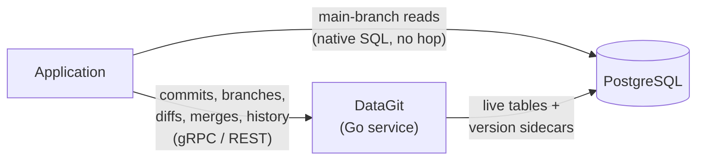

# DataGit

**Git-style version control for the data in your database.**

DataGit is a service that sits between your application and your relational database. It gives your data the things Git gives your code — commits, branches, diffs, three-way merges, tags, blame, and a complete, tamper-evident history — without moving your data out of the database you already run.

Your rows stay in your PostgreSQL instance (MySQL follows in v1.1). Your production reads stay on the fast path, hitting the live tables directly with no proxy in between. DataGit owns the *writes*, the *history*, and the *branches*.

> **Status:** design phase. This repository contains the specification. See [DESIGN.md](DESIGN.md) for the full technical design and [PLAN.md](PLAN.md) for the build sequence.

---

## The problem

Application databases forget. An `UPDATE` overwrites the past, and everything you might later want to know is gone with it:

- **Review.** A pricing analyst wants to restate 200 SKUs. Today that means a spreadsheet, a Jira ticket, and an engineer running SQL at 11pm with no review and no undo.
- **Isolation.** Two teams need to prepare conflicting changes to the same reference dataset. There is nowhere to do that except production.
- **Audit.** Who changed this customer's credit limit, when, and as part of what change? Which other rows moved with it?
- **Rollback.** A bad backfill corrupted 40,000 rows an hour ago. Point-in-time restore means losing every legitimate write since.

The usual answers are partial. Audit tables record what changed but cannot branch. Point-in-time restore rolls back everything or nothing. Database-branching platforms (Neon, PlanetScale) branch beautifully for *development* but never merge data back. Purpose-built versioned databases (Dolt) solve all of it — by replacing your database.

DataGit takes the remaining position: **keep your database, add version control on top of it.** Branch, review, and merge for rows is the capability nothing else offers without a migration; audit-grade history is what makes a merged change worth trusting.

## What adopting it actually means

DataGit owns writes. Your application adopts it by routing every write to a tracked table through DataGit's API — not by changing a connection string. For an existing application with a mature data-access layer, that is a rewrite of the write paths for the tables in question. Reads on `main` are untouched.

The realistic first adopters are greenfield services, and applications that can wall off a curated-data subsystem — a pricing service, a reference-data service — behind the API while the rest of the system continues as it is. If you need a drop-in, this is not it, and [DESIGN.md §19.1](DESIGN.md#191-rejected-a-postgresqlmysql-wire-protocol-proxy) explains why a drop-in was rejected. Untracking a table is one command and leaves the live table exactly as it was, so trying it is cheap.

## What DataGit is



- **A control plane for data change.** Commits, branches, tags, diffs, merges, and change proposals, exposed over gRPC and REST with SDKs.
- **A write path.** Your application commits change sets through DataGit instead of issuing raw `INSERT`/`UPDATE`/`DELETE`. Each commit applies the live-table writes, the version records, and the commit itself in one database transaction.
- **A history store that lives in your database.** Version data goes into sidecar tables alongside your own, in the same instance, under the same backup and replication story.

## What DataGit is not

- **Not a database.** It does not store your data, plan your queries, or replace your engine.
- **Not a SQL proxy.** Reads on `main` go straight to your live tables at full native speed. DataGit is not on that path and is not a latency or availability dependency for them.
- **Not a general query engine for branches.** Branch and historical access is a structured API: single-table reads and writes with typed predicates, including predicate updates like "raise every outdoor price by 8%". For joins, aggregates, or arbitrary SQL against a branch, DataGit *materializes* the branch into a real schema you point any client at.
- **Not a replacement for backups.** Version history and backups protect against different failures. You need both.

---

## Core concepts

| Concept | Meaning |
|---|---|
| **Repository** | A set of versioned tables inside one database, versioned together. |
| **Live table** | Your own table, schema unmodified. It is always exactly `main@HEAD`. Direct readers see nothing unusual. |
| **Commit** | An immutable, content-hashed change set with an author, a message, and parent links. Always a single atomic operation. |
| **Branch** | A named line of commits. Creating one is O(1) and copies no data. |
| **Session** | A private, lease-bound workspace on a branch for changes not yet worth a commit. Invisible to everyone else until committed. `main` has no sessions: it only ever changes by commit. |
| **Tag** | An immutable, human-named pointer to a commit. Used to pin a dataset version. |
| **Proposal** | A reviewable request to merge one branch into another. Diff, comments, approvals, then merge. |
| **Blame** | For any row and column, the commit, author, time, and reason it last changed. |

Two tiers, chosen per table:

- **`audit`** — history only. Every version recorded, full time travel and blame, no branching. Cheap enough for high-volume tables.
- **`versioned`** — full branching, diff, and three-way merge. For reference data, configuration, and anything humans curate.

---

## A tour

Create a repository and put two tables under version control:

```bash
datagit repo init catalog --dsn "$DATABASE_URL"
datagit track products --mode versioned
datagit track order_events --mode audit
```

Branch, change, review, merge — the whole loop:

```bash
datagit branch create q4-pricing
datagit session open q4-pricing        # private workspace; nothing is visible until committed
datagit sql "UPDATE products SET price = price * 1.08 WHERE category = 'outdoor'"
datagit session status
#  products: 312 rows to update
datagit commit -m "Q4 outdoor price increase (approved in FIN-2291)"

datagit diff main..q4-pricing
#  ~ products  312 rows modified
#    products[sku=TENT-4P]  price: 249.00 -> 268.92

datagit proposal create --from q4-pricing --into main --title "Q4 outdoor pricing"
# → proposal #17, awaiting 1 approval (main is protected)

datagit proposal merge 17
```

The `sql` subcommand accepts a deliberately small grammar — single-table `INSERT`, `UPDATE ... WHERE`, `DELETE ... WHERE`, and simple `SELECT` — and compiles it to the structured API. It is not a SQL passthrough.

The merge is a single transaction. When it commits, the live `products` table *is* the new state, and every direct reader sees it at once.

Ask the past a question:

```bash
datagit blame products --pk sku=TENT-4P --column price
#  268.92  a9f3c21  arun@…  2026-08-14  "Q4 outdoor price increase (approved in FIN-2291)"
#  249.00  4c81ee0  maya@…  2026-03-02  "Spring catalog refresh"

datagit read products --at "2026-06-01T00:00:00Z" --where "category = 'outdoor'"
datagit revert a9f3c21 --into main   # a new commit that undoes it; nothing is erased
```

From an application, via the SDK. `Begin` buffers locally; `Commit` sends one request, and the author is whoever authenticated — it cannot be supplied by the client:

```go
tx := dg.Branch("main").Begin(ctx)
tx.Update(ctx, "products", datagit.PK{"sku": "TENT-4P"}, datagit.Values{"price": 268.92})
_, err := tx.Commit(ctx, datagit.CommitOpts{
    Message: "Q4 outdoor price increase",
    Ref:     "FIN-2291",
})
```

---

## How it works, briefly

For every `versioned` table, DataGit maintains a typed **version sidecar** in the same database, storing each row version over a half-open commit-sequence interval, tagged with the branch that produced it and a mask of which columns changed.

- **Commits to `main`** apply the live-table writes, the version records, and the commit record **in one transaction**. There is no uncommitted state on `main`, ever, so direct readers only ever see committed states and every live row has an author and a reason.
- **Work on other branches** touches only the sidecar, either as direct commits or inside a session. The live table is untouched, so `main` stays clean and fast.
- **Reading a branch** resolves each primary key through a short priority chain — the branch's own versions first, then its parent's at the fork point, down to `main`. Filters are evaluated against the *resolved* row, never pushed into the chain, so a branch that changes a row out of a filter's range does not let the parent's old version leak back in.
- **Diffs** are a range scan over the sidecar. They cost what the change costs, not what the table costs.
- **Merges** are three-way against the common ancestor, resolved **per cell**: two branches editing different columns of the same row merge cleanly; editing the same column to different values raises a conflict for a human. A branch catches up with its parent by merging the parent in; rebase is not offered, because it rewrites history.

Commits are hash-chained, so history is tamper-evident — with an honest limit, spelled out in [DESIGN.md §12](DESIGN.md#12-integrity-and-tamper-evidence): DataGit stores its history in your database, so anyone with direct write access to it can rewrite both the data and the record. Detection, and optional external anchoring, are what it offers — not prevention.

**Schema is versioned too — from v1.2.** Branches will be able to add, alter, and drop columns, with diffs showing it and merges reconciling it. Because `main`'s live tables have direct readers, a schema change merging into `main` will not land instantly — it becomes a **migration plan** you apply deliberately, with the destructive parts flagged ([DESIGN.md §10](DESIGN.md#10-schema-versioning-and-merge)). Until v1.2, your existing migration tool owns DDL; DataGit follows additive changes automatically and asks you to re-track a table after anything else.

## Trade-offs, stated plainly

- **Adoption is a write-path rewrite.** See above. There is no drop-in mode.
- **Storage.** A `versioned` table costs 3.3× its size at rest once the sidecar and its indexes are counted, plus history proportional to churn. Retention policies and garbage collection bound the growth.
- **Write amplification is about 9×**, measured in write-ahead-log bytes. Most of it is index maintenance on the sidecar, not the extra rows themselves. This is the number most likely to surprise you when sizing a deployment.
- **Write latency.** Commits go through a network hop and do more work in the transaction. Measured at 1.7 ms added at p99 for a single-row commit.
- **Commit throughput per branch is capped.** Commits to one branch are serialized so their sequence numbers are ordered, which measures at roughly 850 commits per second regardless of how many application instances write. Batch your writes: one commit carrying a thousand rows reaches about 20,000 rows per second. High-volume `audit` tables bypass the serialization entirely.
- **Discipline.** The guarantee "the live table is `main@HEAD`" holds only while writes go through DataGit. Optional trigger guards can reject or capture out-of-band writes, but nothing makes them free, and the guard stops accidents, not adversaries.
- **Branch access is not free SQL.** Structured API, or materialize the branch. Filtered branch reads must be paginated and need an index on the column you filter by — without one they degrade to a full scan of the version history.
- **Very large merges are not atomic.** Above a configurable size, a merge must opt into chunked apply, during which direct readers can see a partial state. The ref is flagged for the duration.
- **Primary keys are row identity.** Changing a primary key reads as a delete plus an insert, and history does not follow it across. Tables without a stable primary key cannot be `versioned`.

## When to use it — and when not to

**Good fit:** reference and master data, pricing, product catalogs, feature flags and configuration, regulatory data with provenance requirements, anything a human curates and someone else should review.

**Poor fit:** append-only event streams (use `audit` mode, or nothing), high-churn ephemeral state (sessions, queues, caches), blob-heavy tables, and workloads where a few milliseconds on the write path is unacceptable.

## Roadmap

| Release | Scope |
|---|---|
| **v1.0** | PostgreSQL. Both tiers, branches, sessions, cell-level merge, proposals, retention, purge, verification. |
| **v1.1** | MySQL at full parity. |
| **v1.2** | Schema versioning and merge with gated migration apply. |
| **v1.3** | Crypto-shredding for GDPR erasure, external anchoring, commit signing, TypeScript and Python SDKs. |

## Documentation

- **[DESIGN.md](DESIGN.md)** — the full technical design: storage layout, read and write paths, the merge algorithm, schema evolution, consistency guarantees, retention and GDPR erasure, failure modes, and the alternatives that were rejected.
- **[PLAN.md](PLAN.md)** — the build sequence: de-risking spikes, milestones, verification strategy, and the risk register.

## Prior art

DataGit is a recombination, not an invention. It owes:

- **[Dolt](https://github.com/dolthub/dolt)** — three-way merge semantics for SQL tables, and the demonstration that branch/merge on relational data is tractable.
- **[lakeFS](https://github.com/treeverse/lakeFS)** — the metadata-layer-over-existing-storage architecture, and the commit/branch/merge vocabulary for data.
- **[Neon](https://neon.com) / [PlanetScale](https://planetscale.com)** — copy-on-write branching, and the reviewed "deploy request" model for schema change.
- **[Datomic](https://www.datomic.com) / [XTDB](https://xtdb.com)** — immutable history and `as-of` time travel as a first-class query mode.
- **SQL:2011 temporal tables** — the interval-versioning model the sidecars are built on.

## License

Apache 2.0.
