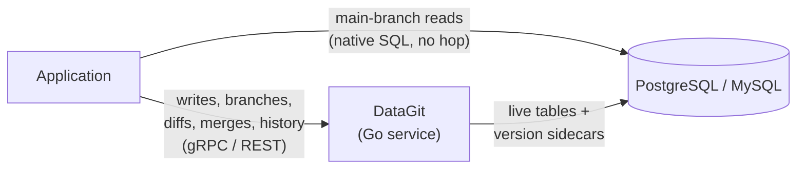

# DataGit

**Git-style version control for the data in your database.**

DataGit is a service that sits between your application and your relational database. It gives your data the things Git gives your code — commits, branches, diffs, three-way merges, tags, blame, and a complete, tamper-evident history — without moving your data out of the database you already run.

Your rows stay in your PostgreSQL or MySQL instance. Your production reads stay on the fast path, hitting the live tables directly with no proxy in between. DataGit owns the *writes*, the *history*, and the *branches*.

> **Status:** design phase. This repository currently contains the specification. See [DESIGN.md](DESIGN.md) for the full technical design.

---

## The problem

Application databases forget. An `UPDATE` overwrites the past, and everything you might later want to know is gone with it:

- **Audit.** Who changed this customer's credit limit, when, and as part of what change? Which other rows moved with it?
- **Rollback.** A bad backfill corrupted 40,000 rows an hour ago. Point-in-time restore means losing every legitimate write since.
- **Review.** A pricing analyst wants to restate 200 SKUs. Today that means a spreadsheet, a Jira ticket, and an engineer running SQL at 11pm with no review and no undo.
- **Isolation.** Two teams need to prepare conflicting changes to the same reference dataset. There is nowhere to do that except production.

The usual answers are partial. Audit tables record what changed but cannot branch. Point-in-time restore rolls back everything or nothing. Database-branching platforms (Neon, PlanetScale) branch beautifully for *development* but never merge data back. Purpose-built versioned databases (Dolt) solve all of it — by replacing your database.

DataGit takes the remaining position: **keep your database, add version control on top of it.**

## What DataGit is



- **A control plane for data change.** Commits, branches, tags, diffs, merges, and change proposals, exposed over gRPC and REST with SDKs.
- **A write path.** Your application writes through DataGit instead of issuing raw `INSERT`/`UPDATE`/`DELETE`. DataGit applies the write and records the version in the same database transaction.
- **A history store that lives in your database.** Version data goes into sidecar tables alongside your own, in the same instance, under the same backup and replication story.

## What DataGit is not

- **Not a database.** It does not store your data, plan your queries, or replace your engine.
- **Not a SQL proxy.** Reads on `main` go straight to your live tables at full native speed. DataGit is not on that path and is not a latency or availability dependency for them.
- **Not a general query engine for branches.** Branch and historical reads are served through a structured read API. For arbitrary SQL against a branch, DataGit *materializes* the branch into a real schema you point any client at.
- **Not a replacement for backups.** Version history and backups protect against different failures. You need both.

---

## Core concepts

| Concept | Meaning |
|---|---|
| **Repository** | A set of versioned tables inside one database, versioned together. |
| **Live table** | Your own table, schema unmodified. It is always exactly `main@HEAD`. Direct readers see nothing unusual. |
| **Commit** | An immutable, content-hashed set of row and schema changes with an author, a message, and parent links. |
| **Branch** | A named line of commits. Creating one is O(1) and copies no data. |
| **Working set** | Uncommitted changes on a branch — the staging area. |
| **Tag** | An immutable, human-named pointer to a commit. Used to pin a dataset version. |
| **Proposal** | A reviewable request to merge one branch into another. Diff, comments, approvals, then merge. |
| **Blame** | For any row and column, the commit, author, time, and reason it last changed. |

Two tiers, chosen per table:

- **`audit`** — history only. Every version recorded, full time travel and blame, no branching. Cheap enough for high-volume tables.
- **`versioned`** — full branching, diff, and three-way merge. For reference data, configuration, and anything humans curate.

---

## A tour

Create a repository and put two tables under version control:

```bash
datagit repo init catalog --dsn "$DATABASE_URL"
datagit track products --mode versioned
datagit track order_events --mode audit
```

Branch, change, review, merge — the whole loop:

```bash
datagit branch create q4-pricing
datagit --branch q4-pricing sql "UPDATE products SET price = price * 1.08 WHERE category = 'outdoor'"
datagit --branch q4-pricing commit -m "Q4 outdoor price increase (approved in FIN-2291)"

datagit diff main..q4-pricing
#  ~ products  312 rows modified
#    products[sku=TENT-4P]  price: 249.00 -> 268.92

datagit proposal create --from q4-pricing --into main --title "Q4 outdoor pricing"
# → proposal #17, awaiting 1 approval (main is protected)

datagit proposal merge 17
```

The merge is a single transaction. When it commits, the live `products` table *is* the new state, and every direct reader sees it at once.

Ask the past a question:

```bash
datagit blame products --pk sku=TENT-4P --column price
#  268.92  a9f3c21  arun@…  2026-08-14  "Q4 outdoor price increase (approved in FIN-2291)"
#  249.00  4c81ee0  maya@…  2026-03-02  "Spring catalog refresh"

datagit read products --at "2026-06-01T00:00:00Z" --where "category = 'outdoor'"
datagit revert a9f3c21 --into main   # a new commit that undoes it; nothing is erased
```

From an application, via the SDK:

```go
tx := dg.Branch("main").Begin(ctx)
tx.Update(ctx, "products", datagit.PK{"sku": "TENT-4P"}, datagit.Values{"price": 268.92})
_, err := tx.Commit(ctx, datagit.CommitOpts{
    Author:  actor,
    Message: "Q4 outdoor price increase",
    Ref:     "FIN-2291",
})
```

---

## How it works, briefly

For every `versioned` table, DataGit maintains a typed **version sidecar** in the same database, storing each row version over a half-open commit-sequence interval, tagged with the branch that produced it and a mask of which columns changed.

- **Writes to `main`** update the live table and append to the sidecar **in one transaction**. Direct readers never observe a skewed state.
- **Writes to other branches** touch only the sidecar. The live table is untouched, so `main` stays clean and fast.
- **Reading a branch** resolves each primary key through a short priority chain — the branch's own versions first, then its parent's at the fork point, down to `main`.
- **Diffs** are a range scan over the sidecar. They cost what the change costs, not what the table costs.
- **Merges** are three-way against the common ancestor, resolved **per cell**: two branches editing different columns of the same row merge cleanly; editing the same column to different values raises a conflict for a human.

Commits are hash-chained, so history is tamper-evident — with an honest limit, spelled out in [DESIGN.md](DESIGN.md#12-integrity-and-tamper-evidence): DataGit stores its history in your database, so anyone with direct write access to it can rewrite both the data and the record. Detection, and optional external anchoring, are what it offers — not prevention.

**Schema is versioned too.** Branches can add, alter, and drop columns; diffs show it and merges reconcile it. Because `main`'s live tables have direct readers, a schema change merging into `main` does not land instantly — it becomes a **migration plan** you apply deliberately, with the destructive parts flagged. This is the one place DataGit is intentionally not Git-like, and the reasoning is in [DESIGN.md](DESIGN.md#10-schema-versioning-and-merge).

## Trade-offs, stated plainly

- **Storage.** A `versioned` table costs roughly 2× its size at rest, plus history proportional to churn. Retention policies and garbage collection bound the growth.
- **Write latency.** Writes go through a network hop and do more work in the transaction. Budget is a small number of milliseconds over a direct write; the target is < 5 ms added at p99.
- **Discipline.** The guarantee "the live table is `main@HEAD`" holds only while writes go through DataGit. Optional trigger guards can reject or capture out-of-band writes, but nothing makes them free.
- **Branch reads are not free SQL.** Structured read API, or materialize the branch.
- **Primary keys are row identity.** Changing a primary key reads as a delete plus an insert, and history does not follow it across.

## When to use it — and when not to

**Good fit:** reference and master data, pricing, product catalogs, feature flags and configuration, regulatory data with provenance requirements, anything a human curates and someone else should review.

**Poor fit:** append-only event streams (use `audit` mode, or nothing), high-churn ephemeral state (sessions, queues, caches), blob-heavy tables, and workloads where a few milliseconds on the write path is unacceptable.

## Documentation

- **[DESIGN.md](DESIGN.md)** — the full technical design: storage layout, read and write paths, the merge algorithm, schema evolution, consistency guarantees, retention and GDPR erasure, failure modes, and the alternatives that were rejected.

## Prior art

DataGit is a recombination, not an invention. It owes:

- **[Dolt](https://github.com/dolthub/dolt)** — three-way merge semantics for SQL tables, and the demonstration that branch/merge on relational data is tractable.
- **[lakeFS](https://github.com/treeverse/lakeFS)** — the metadata-layer-over-existing-storage architecture, and the commit/branch/merge vocabulary for data.
- **[Neon](https://neon.com) / [PlanetScale](https://planetscale.com)** — copy-on-write branching, and the reviewed "deploy request" model for schema change.
- **[Datomic](https://www.datomic.com) / [XTDB](https://xtdb.com)** — immutable history and `as-of` time travel as a first-class query mode.
- **SQL:2011 temporal tables** — the interval-versioning model the sidecars are built on.

## License

Apache 2.0.
